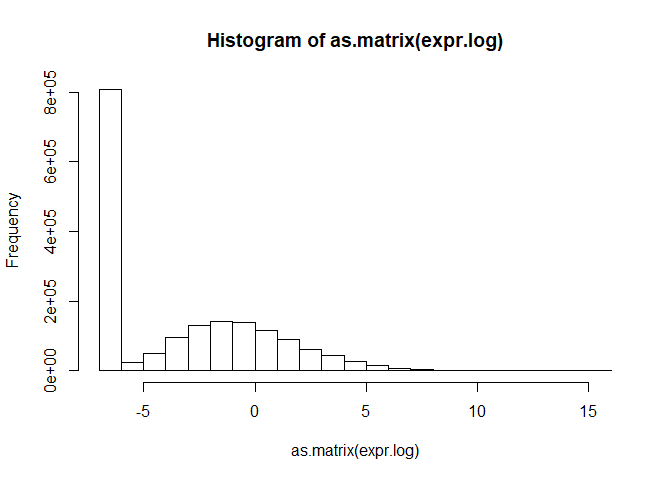
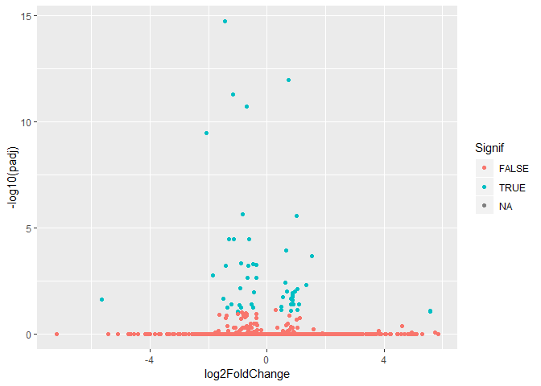

# Expression analysis for FBXO11 knockdown RNA-seq data
Jennifer Grants  
1/9/2019  


## Load saved data   
`expr` is mRNA-seq TPM values, `libs` is metadata

```r
load("./FBXO11/expr.RData")
load("./FBXO11/libs.RData")
```


```r
libs$treatment <- ifelse(test = grepl(pattern = "shSCR", x = libs$specimen_subset_external_id), yes = "shSCR", no = 
                           ifelse(test = grepl(pattern = "shFBXO11#9", x = libs$specimen_subset_external_id), yes = "shFBXO11.a", no = "shFBXO11.b"))
```


```r
kable(libs)
```


library_name   sequencing_effort     platform_name   platform_version   specimen_subset_external_id   cohort_no   library_qc_info   index_sequence   treatment  
-------------  --------------------  --------------  -----------------  ----------------------------  ----------  ----------------  ---------------  -----------
A54939         Karsan Lab Research   ssRNA-Seq       v1                 OCI-AML3_shSCR-1              Cohort 6    {}                CCAACA           shSCR      
A54940         Karsan Lab Research   ssRNA-Seq       v1                 OCI-AML3_shFBXO11#9-1         Cohort 6    {}                CTAGCT           shFBXO11.a 
A54941         Karsan Lab Research   ssRNA-Seq       v1                 OCI-AML3_shFBXO11#10-1        Cohort 6    {}                GATGCT           shFBXO11.b 
A54942         Karsan Lab Research   ssRNA-Seq       v1                 OCI-AML3_shSCR-2              Cohort 6    {}                TAATCG           shSCR      
A54943         Karsan Lab Research   ssRNA-Seq       v1                 OCI-AML3_shFBXO11#9-2         Cohort 6    {}                TGAATG           shFBXO11.a 
A54944         Karsan Lab Research   ssRNA-Seq       v1                 OCI-AML3_shFBXO11#10-2        Cohort 6    {}                AGTTCC           shFBXO11.b 
A54945         Karsan Lab Research   ssRNA-Seq       v1                 OCI-AML3_shSCR-3              Cohort 6    {}                CGATGT           shSCR      
A54946         Karsan Lab Research   ssRNA-Seq       v1                 OCI-AML3_shFBXO11#9-3         Cohort 6    {}                TAGCTT           shFBXO11.a 
A54947         Karsan Lab Research   ssRNA-Seq       v1                 OCI-AML3_shFBXO11#10-3        Cohort 6    {}                AACTTG           shFBXO11.b 

## Quality control checks  

### First convert row names from column "Names":  

```r
expr2 <- column_to_rownames(expr, var = "Name")
```

```
## Warning: Setting row names on a tibble is deprecated.
```

```r
head(expr2)
```

```
## # A tibble: 6 x 9
##   A54945 A54947 A54946 A54944 A54940 A54942 A54941 A54939 A54943
##    <dbl>  <dbl>  <dbl>  <dbl>  <dbl>  <dbl>  <dbl>  <dbl>  <dbl>
## 1  0.176  0.561  0.102  0.459  0.115  0.307  0.274 0.381   0.180
## 2  0.609  0.235  0.170  0      0.141  0.267  0.514 0.0454  0    
## 3  3.94   4.44   4.94   4.64   3.26   2.98   3.09  4.44    2.96 
## 4  0      0      0      0      0      0      0     0       0    
## 5  0      0      0      0      0      0      0     0       0    
## 6  0      0      0      0      0      0      0     0       0
```


### Dimensions:   

```r
# expression data
dim(expr2)
```

```
## [1] 195480      9
```

```r
# metadata
dim(libs)
```

```
## [1] 9 9
```


### NA values:   

```r
any(is.na(expr2))
```

```
## [1] FALSE
```


### Range:  

```r
range(expr2)
```

```
## [1]     0.00 39567.71
```


```r
hist(as.matrix(expr2))
```

<!-- -->
Appears not to be log transformed.    


## Data transformation / row normalization  
### Log2 transformation  

```r
# log2 transformation with constant +0.01 added to allow transformation of zeros
expr.log <- log2(expr2 + 0.01)

# Visualize log transformed data
hist(as.matrix(expr.log))
```

<!-- -->
ASK: Why does this have so many 0 values? Is this normal for RNA-seq?  


## DE-seq  

```r
design.table <- select(libs, library_name, treatment) %>%
  column_to_rownames(var = "library_name")
```

```
## Warning: Setting row names on a tibble is deprecated.
```

```r
expr.matrix <- column_to_rownames(expr, var = "Name") %>%
  select(rownames(design.table)) %>% # put columns in same order as the design matrix
  as.matrix()
```

```
## Warning: Setting row names on a tibble is deprecated.
```

```r
# filter to "highly expressed" genes
thresh <- expr.matrix >= 1
keep <- rowSums(thresh) >= 2 # keep rows where there are > 2 samples with tpm > 1

expr.matrix.keep <- expr.matrix[keep,]

# convert to integers for DEseq
int.matrix.keep <- round(expr.matrix.keep, digits = 0)

dds <- DESeqDataSetFromMatrix(countData = int.matrix.keep, colData = design.table, design = ~treatment)
```

```
## converting counts to integer mode
```

```
## Warning in DESeqDataSet(se, design = design, ignoreRank): some variables in
## design formula are characters, converting to factors
```

```r
res <- DESeq(dds)
```

```
## estimating size factors
```

```
## estimating dispersions
```

```
## gene-wise dispersion estimates
```

```
## mean-dispersion relationship
```

```
## final dispersion estimates
```

```
## fitting model and testing
```


### Summarise results by each treatment group  

#### shFBXO11.a vs. shSCR  

```r
resultsNames(res)
```

```
## [1] "Intercept"           "treatmentshFBXO11.a" "treatmentshFBXO11.b"
## [4] "treatmentshSCR"
```

```r
result.pair <- results(res, contrast = c("treatment", "shFBXO11.a", "shSCR")) # contrast: the factor, then numerator, then denominator

kable(head(result.pair[which(result.pair$padj < 0.05),]))
```

                     baseMean   log2FoldChange       lfcSE        stat      pvalue        padj
----------------  -----------  ---------------  ----------  ----------  ----------  ----------
ENST00000373449      98.18959       -0.6154148   0.1730254   -3.556787   0.0003754   0.0166010
ENST00000396651    1376.61361       -0.3277501   0.0647095   -5.064949   0.0000004   0.0000502
ENST00000370321    1253.92354       -0.3357185   0.0741403   -4.528154   0.0000060   0.0005482
ENST00000369642      79.15805        0.9728605   0.2301667    4.226765   0.0000237   0.0016909
ENST00000369637      84.30236        0.8126939   0.2194637    3.703091   0.0002130   0.0107027
ENST00000607355      52.60446        1.5005047   0.2357706    6.364256   0.0000000   0.0000001

```r
write.csv(x = result.pair, file = "./FBXO11/DEseq/shFBXO11a_vs_shSCR.csv")
```


```r
# cutoffs: padj < 0.1, |FC| > 1.25 (permissive)
dat.a <- read.csv("./FBXO11/DEseq/shFBXO11a_vs_shSCR.csv") %>%
  mutate(Signif_p = -log10(padj) > -log10(0.1), 
         Signif_delta = abs(log2FoldChange) > log2(1.25),
         Signif = Signif_p == TRUE & Signif_delta == TRUE)

ggplot(dat.a, aes(log2FoldChange, -log10(padj))) +
  geom_point(aes(colour = Signif))
```

```
## Warning: Removed 45392 rows containing missing values (geom_point).
```

<!-- -->


#### shFBXO11.b vs shSCR  

```r
result.pair <- results(res, contrast = c("treatment", "shFBXO11.b", "shSCR")) # contrast: the factor, then numerator, then denominator

kable(head(result.pair[which(result.pair$padj < 0.05),]))
```

                    baseMean   log2FoldChange       lfcSE        stat      pvalue        padj
----------------  ----------  ---------------  ----------  ----------  ----------  ----------
ENST00000344843    185.20045       -1.3292405   0.1440932   -9.224868   0.0000000   0.0000000
ENST00000376957    536.58206       -0.4424597   0.0978025   -4.524014   0.0000061   0.0006046
ENST00000329421     92.97947       -0.8194523   0.1756655   -4.664844   0.0000031   0.0003664
ENST00000582401     89.83154        0.7880786   0.1767377    4.459029   0.0000082   0.0007596
ENST00000607355     52.60446        0.7800902   0.2404243    3.244640   0.0011760   0.0395865
ENST00000480760     48.09922        0.8970869   0.2149420    4.173623   0.0000300   0.0021964

```r
write.csv(x = result.pair, file = "./FBXO11/DEseq/shFBXO11b_vs_shSCR.csv")
```


```r
# cutoffs: padj < 0.1, |FC| > 1.25 (permissive)
dat.b <- read.csv("./FBXO11/DEseq/shFBXO11b_vs_shSCR.csv") %>%
  mutate(Signif_p = -log10(padj) > -log10(0.1), 
         Signif_delta = abs(log2FoldChange) > log2(1.25),
         Signif = Signif_p == TRUE & Signif_delta == TRUE)

ggplot(dat.b, aes(log2FoldChange, -log10(padj))) +
  geom_point(aes(colour = Signif))
```

```
## Warning: Removed 47323 rows containing missing values (geom_point).
```

<!-- -->


## Heatmap for differentially expressed genes in either shFBXO11 treatment  

```r
# filter to genes that are "signif" in the volcano plots above in either treatment
genes_a <- dat.a[which(dat.a$Signif == TRUE),]$X %>% as.vector()
genes_b <- dat.b[which(dat.b$Signif == TRUE),]$X %>% as.vector()

signif.genes <- c(genes_a, genes_b)

expr.signif <- expr[which(expr$Name %in% signif.genes),]

expr.signif2 <- column_to_rownames(expr.signif, var = "Name")
```

```
## Warning: Setting row names on a tibble is deprecated.
```

```r
head(expr.signif2)
```

```
## # A tibble: 6 x 9
##   A54945 A54947 A54946 A54944 A54940 A54942 A54941 A54939 A54943
##    <dbl>  <dbl>  <dbl>  <dbl>  <dbl>  <dbl>  <dbl>  <dbl>  <dbl>
## 1   229.   89.2  248.    75.8  259.    213.   83.9  241.   237. 
## 2   580.  451.   597.   425.   621.    572.  407.   634.   555. 
## 3   122.   71.2   94.0   62.1  101.    116.   61.0  133.    78.8
## 4   114.  119.    68.1  112.    66.0   120.  114.    95.0   74.3
## 5   152.  130.   105.   137.    72.2   129.   92.6  120.    73.4
## 6  1493. 1372.  1272.  1345.  1240.   1546. 1290.  1599.  1240.
```

Log transform, and scale rows:  

```r
# don't need to add a constant for the log scaling because all are >0
log.norm <- log2(expr.signif2) %>%
  t() %>% scale() %>% (t) %>% ## method from https://github.com/STAT540-UBC/STAT540-UBC.github.io/blob/master/seminars/seminars_winter_2019/seminar6/sm06_clustering-pca.md
  as.matrix()

log.norm <- na.omit(log.norm)
any(is.na(log.norm))
```

```
## [1] FALSE
```


```r
library(RColorBrewer)

heatmap_pallete <- colorRampPalette(brewer.pal(8, name = "RdBu"))(21) %>% rev

anno.frame <- data.frame(sample = colnames(log.norm), shRNA = libs[match(colnames(log.norm), libs$library_name),]$treatment) %>%
  column_to_rownames(var = "sample")

anno.frame$shRNA <- factor(anno.frame$shRNA, levels = c("shSCR", "shFBXO11.a", "shFBXO11.b"))

as.matrix(log.norm) %>%
pheatmap(cluster_cols = T, 
         cluster_rows = T, 
         scale = "none", 
         clustering_method = "ward.D2", 
         clustering_distance_cols = "euclidean", 
         show_rownames = F, 
         annotation_col = anno.frame, color = heatmap_pallete)
```

<!-- -->

> Conclusion: When considering all differentially expressed genes (union), shFBXO11.b (#10) is more similar to shSCR than shFBXO11.a (#9).  


## Heatmap for differentially expressed genes in BOTH shFBXO11 constructs  

```r
signif.genes <- intersect(genes_a, genes_b)

expr.signif <- expr[which(expr$Name %in% signif.genes),]

expr.signif2 <- column_to_rownames(expr.signif, var = "Name")
```

```
## Warning: Setting row names on a tibble is deprecated.
```

```r
head(expr.signif2)
```

```
## # A tibble: 6 x 9
##   A54945 A54947 A54946 A54944 A54940 A54942 A54941 A54939 A54943
##    <dbl>  <dbl>  <dbl>  <dbl>  <dbl>  <dbl>  <dbl>  <dbl>  <dbl>
## 1   18.5   50.4   85.0   48.8  104.    17.6   42.2   31.5   76.7
## 2  219.   324.   161.   305.   160.   229.   288.   217.   149. 
## 3   82.3   47.8   19.7   46.3   27.4   73.5   45.1   95.7   19.6
## 4  103.   213.   190.   201.   269.   108.   223.   157.   178. 
## 5   78.5  110.   129.   126.   128.    78.9  154.    87.9  159. 
## 6   93.5   22.6   32.9   19.1   28.7   84.5   21.8   95.8   27.7
```

Log transform, and scale rows:  

```r
# don't need to add a constant for the log scaling because all are >0
log.norm <- log2(expr.signif2) %>%
  t() %>% scale() %>% (t) %>% ## method from https://github.com/STAT540-UBC/STAT540-UBC.github.io/blob/master/seminars/seminars_winter_2019/seminar6/sm06_clustering-pca.md
  as.matrix()

log.norm <- na.omit(log.norm)
any(is.na(log.norm))
```

```
## [1] FALSE
```


```r
anno.frame <- data.frame(sample = colnames(log.norm), shRNA = libs[match(colnames(log.norm), libs$library_name),]$treatment) %>%
  column_to_rownames(var = "sample")

anno.frame$shRNA <- factor(anno.frame$shRNA, levels = c("shSCR", "shFBXO11.a", "shFBXO11.b"))

as.matrix(log.norm) %>%
pheatmap(cluster_cols = T, 
         cluster_rows = T, 
         scale = "none", 
         clustering_method = "ward.D2", 
         clustering_distance_cols = "euclidean", 
         show_rownames = F, 
         annotation_col = anno.frame, color = heatmap_pallete)
```

<!-- -->

> Conclusion: When considering the common DE genes (intersection), the two shFBXO11 treatments cluster distinctly from shSCR.  

> Observation: All but 3 genes apprear to have the same directionality of change (up, up ; down, down) in the shFBXO11 treatments vs. shSCR.  

