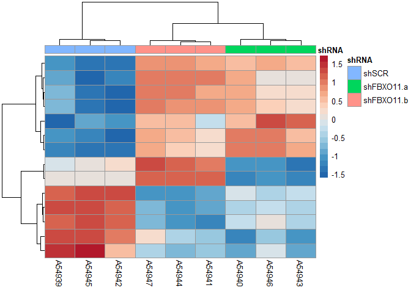

# Expression analysis for FBXO11 knockdown RNA-seq data
Jennifer Grants  
1/9/2019  


## Load saved data   
`expr` is mRNA-seq TPM values, `libs` is metadata

```r
load("./FBXO11/expr.RData")
load("./FBXO11/libs.RData")
```


```r
libs$treatment <- ifelse(test = grepl(pattern = "shSCR", x = libs$specimen_subset_external_id), yes = "shSCR", no = 
                           ifelse(test = grepl(pattern = "shFBXO11#9", x = libs$specimen_subset_external_id), yes = "shFBXO11.a", no = "shFBXO11.b"))
```


```r
kable(libs)
```


library_name   sequencing_effort     platform_name   platform_version   specimen_subset_external_id   cohort_no   library_qc_info   index_sequence   treatment  
-------------  --------------------  --------------  -----------------  ----------------------------  ----------  ----------------  ---------------  -----------
A54939         Karsan Lab Research   ssRNA-Seq       v1                 OCI-AML3_shSCR-1              Cohort 6    {}                CCAACA           shSCR      
A54940         Karsan Lab Research   ssRNA-Seq       v1                 OCI-AML3_shFBXO11#9-1         Cohort 6    {}                CTAGCT           shFBXO11.a 
A54941         Karsan Lab Research   ssRNA-Seq       v1                 OCI-AML3_shFBXO11#10-1        Cohort 6    {}                GATGCT           shFBXO11.b 
A54942         Karsan Lab Research   ssRNA-Seq       v1                 OCI-AML3_shSCR-2              Cohort 6    {}                TAATCG           shSCR      
A54943         Karsan Lab Research   ssRNA-Seq       v1                 OCI-AML3_shFBXO11#9-2         Cohort 6    {}                TGAATG           shFBXO11.a 
A54944         Karsan Lab Research   ssRNA-Seq       v1                 OCI-AML3_shFBXO11#10-2        Cohort 6    {}                AGTTCC           shFBXO11.b 
A54945         Karsan Lab Research   ssRNA-Seq       v1                 OCI-AML3_shSCR-3              Cohort 6    {}                CGATGT           shSCR      
A54946         Karsan Lab Research   ssRNA-Seq       v1                 OCI-AML3_shFBXO11#9-3         Cohort 6    {}                TAGCTT           shFBXO11.a 
A54947         Karsan Lab Research   ssRNA-Seq       v1                 OCI-AML3_shFBXO11#10-3        Cohort 6    {}                AACTTG           shFBXO11.b 

# Quality control checks  

### First convert row names from column "Names":  

```r
expr2 <- column_to_rownames(expr, var = "Name")
```

```
## Warning: Setting row names on a tibble is deprecated.
```

```r
head(expr2)
```

```
## # A tibble: 6 x 9
##   A54945 A54947 A54946 A54944 A54940 A54942 A54941 A54939 A54943
##    <dbl>  <dbl>  <dbl>  <dbl>  <dbl>  <dbl>  <dbl>  <dbl>  <dbl>
## 1  0.176  0.561  0.102  0.459  0.115  0.307  0.274 0.381   0.180
## 2  0.609  0.235  0.170  0      0.141  0.267  0.514 0.0454  0    
## 3  3.94   4.44   4.94   4.64   3.26   2.98   3.09  4.44    2.96 
## 4  0      0      0      0      0      0      0     0       0    
## 5  0      0      0      0      0      0      0     0       0    
## 6  0      0      0      0      0      0      0     0       0
```


### Dimensions:   

```r
# expression data
dim(expr2)
```

```
## [1] 195480      9
```

```r
# metadata
dim(libs)
```

```
## [1] 9 9
```


### NA values:   

```r
any(is.na(expr2))
```

```
## [1] FALSE
```


### Range:  

```r
range(expr2)
```

```
## [1]     0.00 39567.71
```


```r
hist(as.matrix(expr2))
```

<!-- -->
Appears not to be log transformed.    


## Data transformation / row normalization  
### Log2 transformation  

```r
# log2 transformation with constant +0.01 added to allow transformation of zeros
expr.log <- log2(expr2 + 0.01)

# Visualize log transformed data
hist(as.matrix(expr.log))
```

<!-- -->
ASK: Why does this have so many 0 values? Is this normal for RNA-seq?  


# DE-seq  

> NOTE: Limma analysis appears to have more power for detecting relevant gene expression changes, probably because it better estimates the variance and because it is possible to model 3 conditions to avoid losing power

> Skip to Limma section!!


```r
design.table <- select(libs, library_name, treatment) %>%
  column_to_rownames(var = "library_name")
```

```
## Warning: Setting row names on a tibble is deprecated.
```

```r
expr.matrix <- column_to_rownames(expr, var = "Name") %>%
  select(rownames(design.table)) %>% # put columns in same order as the design matrix
  as.matrix()
```

```
## Warning: Setting row names on a tibble is deprecated.
```

```r
# filter to "highly expressed" genes
thresh <- expr.matrix >= 1
keep <- rowSums(thresh) >= 2 # keep rows where there are > 2 samples with tpm > 1

expr.matrix.keep <- expr.matrix[keep,]

# convert to integers for DEseq
int.matrix.keep <- round(expr.matrix.keep, digits = 0)

dds <- DESeqDataSetFromMatrix(countData = int.matrix.keep, colData = design.table, design = ~treatment)
```

```
## converting counts to integer mode
```

```
## Warning in DESeqDataSet(se, design = design, ignoreRank): some variables in
## design formula are characters, converting to factors
```

```r
res <- DESeq(dds)
```

```
## estimating size factors
```

```
## estimating dispersions
```

```
## gene-wise dispersion estimates
```

```
## mean-dispersion relationship
```

```
## final dispersion estimates
```

```
## fitting model and testing
```


## Summarise results by each treatment group  

### shFBXO11.a vs. shSCR  

```r
resultsNames(res)
```

```
## [1] "Intercept"           "treatmentshFBXO11.a" "treatmentshFBXO11.b"
## [4] "treatmentshSCR"
```

```r
result.pair <- results(res, contrast = c("treatment", "shFBXO11.a", "shSCR")) # contrast: the factor, then numerator, then denominator

kable(head(result.pair[which(result.pair$padj < 0.05),]))
```

                     baseMean   log2FoldChange       lfcSE        stat      pvalue        padj
----------------  -----------  ---------------  ----------  ----------  ----------  ----------
ENST00000373449      98.18959       -0.6154148   0.1730254   -3.556787   0.0003754   0.0166010
ENST00000396651    1376.61361       -0.3277501   0.0647095   -5.064949   0.0000004   0.0000502
ENST00000370321    1253.92354       -0.3357185   0.0741403   -4.528154   0.0000060   0.0005482
ENST00000369642      79.15805        0.9728605   0.2301667    4.226765   0.0000237   0.0016909
ENST00000369637      84.30236        0.8126939   0.2194637    3.703091   0.0002130   0.0107027
ENST00000607355      52.60446        1.5005047   0.2357706    6.364256   0.0000000   0.0000001

```r
write.csv(x = result.pair, file = "./FBXO11/DEseq/shFBXO11a_vs_shSCR.csv")
```


```r
# cutoffs: padj < 0.1, |FC| > 1.25 (permissive)
dat.a <- read.csv("./FBXO11/DEseq/shFBXO11a_vs_shSCR.csv") %>%
  mutate(Signif_p = -log10(padj) > -log10(0.1), 
         Signif_delta = abs(log2FoldChange) > log2(1.25),
         Signif = Signif_p == TRUE & Signif_delta == TRUE)

ggplot(dat.a, aes(log2FoldChange, -log10(padj))) +
  geom_point(aes(colour = Signif))
```

```
## Warning: Removed 45392 rows containing missing values (geom_point).
```

<!-- -->


### shFBXO11.b vs shSCR  

```r
result.pair <- results(res, contrast = c("treatment", "shFBXO11.b", "shSCR")) # contrast: the factor, then numerator, then denominator

kable(head(result.pair[which(result.pair$padj < 0.05),]))
```

                    baseMean   log2FoldChange       lfcSE        stat      pvalue        padj
----------------  ----------  ---------------  ----------  ----------  ----------  ----------
ENST00000344843    185.20045       -1.3292405   0.1440932   -9.224868   0.0000000   0.0000000
ENST00000376957    536.58206       -0.4424597   0.0978025   -4.524014   0.0000061   0.0006046
ENST00000329421     92.97947       -0.8194523   0.1756655   -4.664844   0.0000031   0.0003664
ENST00000582401     89.83154        0.7880786   0.1767377    4.459029   0.0000082   0.0007596
ENST00000607355     52.60446        0.7800902   0.2404243    3.244640   0.0011760   0.0395865
ENST00000480760     48.09922        0.8970869   0.2149420    4.173623   0.0000300   0.0021964

```r
write.csv(x = result.pair, file = "./FBXO11/DEseq/shFBXO11b_vs_shSCR.csv")
```


```r
# cutoffs: padj < 0.1, |FC| > 1.25 (permissive)
dat.b <- read.csv("./FBXO11/DEseq/shFBXO11b_vs_shSCR.csv") %>%
  mutate(Signif_p = -log10(padj) > -log10(0.1), 
         Signif_delta = abs(log2FoldChange) > log2(1.25),
         Signif = Signif_p == TRUE & Signif_delta == TRUE)

ggplot(dat.b, aes(log2FoldChange, -log10(padj))) +
  geom_point(aes(colour = Signif))
```

```
## Warning: Removed 47323 rows containing missing values (geom_point).
```

<!-- -->


## Heatmap for differentially expressed genes in either shFBXO11 treatment  

```r
# filter to genes that are "signif" in the volcano plots above in either treatment
genes_a <- dat.a[which(dat.a$Signif == TRUE),]$X %>% as.vector()
genes_b <- dat.b[which(dat.b$Signif == TRUE),]$X %>% as.vector()

signif.genes <- c(genes_a, genes_b)

expr.signif <- expr[which(expr$Name %in% signif.genes),]

expr.signif2 <- column_to_rownames(expr.signif, var = "Name")
```

```
## Warning: Setting row names on a tibble is deprecated.
```

```r
head(expr.signif2)
```

```
## # A tibble: 6 x 9
##   A54945 A54947 A54946 A54944 A54940 A54942 A54941 A54939 A54943
##    <dbl>  <dbl>  <dbl>  <dbl>  <dbl>  <dbl>  <dbl>  <dbl>  <dbl>
## 1   229.   89.2  248.    75.8  259.    213.   83.9  241.   237. 
## 2   580.  451.   597.   425.   621.    572.  407.   634.   555. 
## 3   122.   71.2   94.0   62.1  101.    116.   61.0  133.    78.8
## 4   114.  119.    68.1  112.    66.0   120.  114.    95.0   74.3
## 5   152.  130.   105.   137.    72.2   129.   92.6  120.    73.4
## 6  1493. 1372.  1272.  1345.  1240.   1546. 1290.  1599.  1240.
```

Log transform, and scale rows:  

```r
# don't need to add a constant for the log scaling because all are >0
log.norm <- log2(expr.signif2) %>%
  t() %>% scale() %>% (t) %>% ## method from https://github.com/STAT540-UBC/STAT540-UBC.github.io/blob/master/seminars/seminars_winter_2019/seminar6/sm06_clustering-pca.md
  as.matrix()

log.norm <- na.omit(log.norm)
any(is.na(log.norm))
```

```
## [1] FALSE
```


```r
library(RColorBrewer)

heatmap_pallete <- colorRampPalette(brewer.pal(8, name = "RdBu"))(21) %>% rev

anno.frame <- data.frame(sample = colnames(log.norm), shRNA = libs[match(colnames(log.norm), libs$library_name),]$treatment) %>%
  column_to_rownames(var = "sample")

anno.frame$shRNA <- factor(anno.frame$shRNA, levels = c("shSCR", "shFBXO11.a", "shFBXO11.b"))

as.matrix(log.norm) %>%
pheatmap(cluster_cols = T, 
         cluster_rows = T, 
         scale = "none", 
         clustering_method = "ward.D2", 
         clustering_distance_cols = "euclidean", 
         show_rownames = F, 
         annotation_col = anno.frame, color = heatmap_pallete)
```

<!-- -->

> Conclusion: When considering all differentially expressed genes (union), shFBXO11.b (#10) is more similar to shSCR than shFBXO11.a (#9).  

> Overall: Try Limma analysis to better estimate variance and to avoid losing statistical power when doing separate pairwise comparisons.


## Heatmap for differentially expressed genes in BOTH shFBXO11 constructs  

```r
signif.genes <- intersect(genes_a, genes_b)

expr.signif <- expr[which(expr$Name %in% signif.genes),]

expr.signif2 <- column_to_rownames(expr.signif, var = "Name")
```

```
## Warning: Setting row names on a tibble is deprecated.
```

```r
head(expr.signif2)
```

```
## # A tibble: 6 x 9
##   A54945 A54947 A54946 A54944 A54940 A54942 A54941 A54939 A54943
##    <dbl>  <dbl>  <dbl>  <dbl>  <dbl>  <dbl>  <dbl>  <dbl>  <dbl>
## 1   18.5   50.4   85.0   48.8  104.    17.6   42.2   31.5   76.7
## 2  219.   324.   161.   305.   160.   229.   288.   217.   149. 
## 3   82.3   47.8   19.7   46.3   27.4   73.5   45.1   95.7   19.6
## 4  103.   213.   190.   201.   269.   108.   223.   157.   178. 
## 5   78.5  110.   129.   126.   128.    78.9  154.    87.9  159. 
## 6   93.5   22.6   32.9   19.1   28.7   84.5   21.8   95.8   27.7
```

Log transform, and scale rows:  

```r
# don't need to add a constant for the log scaling because all are >0
log.norm <- log2(expr.signif2) %>%
  t() %>% scale() %>% (t) %>% ## method from https://github.com/STAT540-UBC/STAT540-UBC.github.io/blob/master/seminars/seminars_winter_2019/seminar6/sm06_clustering-pca.md
  as.matrix()

log.norm <- na.omit(log.norm)
any(is.na(log.norm))
```

```
## [1] FALSE
```


```r
anno.frame <- data.frame(sample = colnames(log.norm), shRNA = libs[match(colnames(log.norm), libs$library_name),]$treatment) %>%
  column_to_rownames(var = "sample")

anno.frame$shRNA <- factor(anno.frame$shRNA, levels = c("shSCR", "shFBXO11.a", "shFBXO11.b"))

as.matrix(log.norm) %>%
pheatmap(cluster_cols = T, 
         cluster_rows = T, 
         scale = "none", 
         clustering_method = "ward.D2", 
         clustering_distance_cols = "euclidean", 
         show_rownames = F, 
         annotation_col = anno.frame, color = heatmap_pallete)
```

<!-- -->

> Conclusion: When considering the common DE genes (intersection), the two shFBXO11 treatments cluster distinctly from shSCR.  

> Observation: All but 3 genes apprear to have the same directionality of change (up, up ; down, down) in the shFBXO11 treatments vs. shSCR.  


# Limma analysis  

> Note: Limma analysis works well for low "n" experiments because it uses a moderated t-test to better estimate variance across genes. 

> It IS possible to perform limma for 3 groups, then report results for each comparison (avoids losing power!)


Method from Limma User Guide section on RNA-seq: https://www.bioconductor.org/packages/devel/bioc/vignettes/limma/inst/doc/usersguide.pdf  


```r
## Reload saved data
load("./FBXO11/expr.RData")
load("./FBXO11/libs.RData")


# Design factors
libs$treatment <- ifelse(test = grepl(pattern = "shSCR", x = libs$specimen_subset_external_id), yes = "ctrl", no = 
                           ifelse(test = grepl(pattern = "shFBXO11#9", x = libs$specimen_subset_external_id), yes = "shFBXO11.a", no = "shFBXO11.b"))

design.table <- select(libs, library_name, treatment) %>%
  column_to_rownames(var = "library_name")
```

```
## Warning: Setting row names on a tibble is deprecated.
```

```r
design.table$treatment <- factor(design.table$treatment, levels = c("ctrl", "shFBXO11.a", "shFBXO11.b"))

  ## commented out the stuff for the makeContrasts() method
  #design.table$shSCR <- ifelse(design.table$treatment == "shSCR", yes = 1, no = 0)
  #design.table$shFBXO11.a <- ifelse(design.table$treatment == "shFBXO11.a", yes = 1, no = 0)
  #design.table$shFBXO11.b <- ifelse(design.table$treatment == "shFBXO11.b", yes = 1, no = 0)
  #design.table <- select(design.table, -treatment) %>% as.matrix()

# make model matrix
model.matrix <- model.matrix(~treatment, data = design.table)

  ## commented out the stuff for the makeContrasts() method
  #x <- c("shSCR-shFBXO11.b")
  #contrast.matrix <- makeContrasts(contrasts = x, levels = design.table)


# convert expr to matrix
expr.matrix <- column_to_rownames(expr, var = "Name") %>%
  select(rownames(design.table)) %>% # put columns in same order as the design matrix
  as.matrix()
```

```
## Warning: Setting row names on a tibble is deprecated.
```

```r
# filter to "highly expressed" genes
thresh <- expr.matrix >= 5
keep <- rowSums(thresh) >= 2 # keep rows where there are > 2 samples with tpm > 5

expr.matrix.keep <- expr.matrix[keep,]
```


## Normalizing & log transformation

```r
dge <- DGEList(counts = expr.matrix.keep)

dge <- calcNormFactors(dge) # From the Limma Userguide: It is usual to apply scale normalization to RNA-seq read counts, and the TMM normalization method [34] in particular has been found to perform well in comparative studies. This can be applied to the DGEList object

head(dge$counts)
```

```
##                     A54939     A54940     A54941     A54942     A54943
## ENST00000494149   7.491241   3.406867   5.204649   6.812622   4.527275
## ENST00000623083   6.723140   7.166121   7.513370   6.213673   6.145557
## ENST00000599771   9.128803   9.273547   9.977130  14.545309  10.078416
## ENST00000416931 119.985967 165.840842 162.077902 116.268604 120.318414
## ENST00000457540  58.084029  64.861148  73.284931  70.872431  73.885293
## ENST00000617238 350.485344 286.532116 429.256664 433.241176 285.599971
##                     A54944     A54945     A54946     A54947
## ENST00000494149   5.917108   6.312374   6.817580   5.484473
## ENST00000623083   7.718823   6.107802   6.883171   7.712641
## ENST00000599771  14.117502  13.374769  13.281399  11.277027
## ENST00000416931  94.180728  93.371523  61.124406  88.833200
## ENST00000457540  67.842562  68.317703  60.415320  67.094112
## ENST00000617238 320.779323 214.998546 175.050479 260.938612
```

```r
log.dge <- cpm(x = dge, normalized.lib.sizes = FALSE, log = TRUE, lib.size = NA) # using the cpm function to take the log2(count+0.01), BUT since the values are already in TPM, set all other paramters to FALSE or NA to avoid taking "per million" again.

kable(head(log.dge))
```

                     A54939     A54940     A54941     A54942     A54943     A54944     A54945     A54946     A54947
----------------  ---------  ---------  ---------  ---------  ---------  ---------  ---------  ---------  ---------
ENST00000494149    3.052460   1.971256   2.547493   2.923034   2.356299   2.728229   2.815586   2.931765   2.622053
ENST00000623083    2.901712   2.991249   3.056656   2.795183   2.777150   3.098013   2.769898   2.945095   3.095639
ENST00000599771    3.329284   3.352069   3.454284   3.989907   3.468592   3.948402   3.869508   3.868930   3.629341
ENST00000416931    7.009542   7.476353   7.442665   6.967263   7.013700   6.664869   6.650100   6.050378   6.579475
ENST00000457540    5.966089   6.125361   6.300260   6.255078   6.312084   6.193109   6.200790   6.033613   6.175873
ENST00000617238    8.554053   8.264335   8.846432   8.862706   8.259103   8.430248   7.851190   7.564522   8.131341

```r
kable(head(log2(dge$counts))) ## these results are fairly similar, so I think that my method using cpm() worked
```

                     A54939     A54940     A54941     A54942     A54943     A54944     A54945     A54946     A54947
----------------  ---------  ---------  ---------  ---------  ---------  ---------  ---------  ---------  ---------
ENST00000494149    2.905205   1.768446   2.379801   2.768210   2.178643   2.564892   2.658183   2.769260   2.455353
ENST00000623083    2.749135   2.841192   2.909460   2.635446   2.619544   2.948381   2.610653   2.783073   2.947225
ENST00000599771    3.190426   3.213121   3.318625   3.862482   3.333197   3.819413   3.741442   3.731335   3.495315
ENST00000416931    6.906722   7.373655   7.340544   6.861318   6.910714   6.557360   6.544911   5.933677   6.473027
ENST00000457540    5.860070   6.019283   6.195445   6.147153   6.207215   6.084119   6.094188   5.916842   6.068114
ENST00000617238    8.453210   8.162553   8.745697   8.759027   8.157852   8.325437   7.748183   7.451627   8.027567

## Perform limma-trend analysis

```r
fit <- lmFit(object = log.dge, design = model.matrix)  # fit with all groups to avoid losing power, but will need to extract results for each experimental group separately
fit <- eBayes(fit, trend=TRUE)

# results for shFBXO11.a vs. ctrl
top_a <- topTable(fit, coef = "treatmentshFBXO11.a", sort.by = "p", n = Inf) %>% 
  rownames_to_column(var = "Transcript") %>%
  mutate(signif = adj.P.Val < 0.05 & abs(logFC) > 1)
head(top_a)
```

```
##        Transcript     logFC  AveExpr         t      P.Value    adj.P.Val
## 1 ENST00000371732 -3.058143 3.501391 -27.98200 1.946558e-09 3.593540e-05
## 2 ENST00000397406 -2.189460 4.101586 -24.14325 6.451672e-09 5.955216e-05
## 3 ENST00000319340 -1.626931 4.447705 -22.94618 9.741003e-09 5.994289e-05
## 4 ENST00000366903  2.038695 3.005491  21.68305 1.540036e-08 7.107653e-05
## 5 ENST00000221418 -2.080709 7.166133 -19.40071 3.777763e-08 1.394826e-04
## 6 ENST00000290705 -2.817652 3.403743 -17.61194 8.219180e-08 2.528905e-04
##           B signif
## 1 11.105117   TRUE
## 2 10.366337   TRUE
## 3 10.090271   TRUE
## 4  9.770508   TRUE
## 5  9.106369   TRUE
## 6  8.492993   TRUE
```

```r
ggplot(top_a, aes(logFC, -log10(adj.P.Val))) +
  geom_point(aes(color = signif))
```

<!-- -->

```r
write.csv(x = top_a, file = "./FBXO11/Limma/Limma_result_shFBXO11-9_vs_shSCR.csv", row.names = F)

# results for shFBXO11.b vs. ctrl
top_b <- topTable(fit, coef = "treatmentshFBXO11.b", sort.by = "p", n = Inf) %>% 
  rownames_to_column(var = "Transcript") %>%
  mutate(signif = adj.P.Val < 0.05 & abs(logFC) > 1)
head(top_b)
```

```
##        Transcript     logFC  AveExpr         t      P.Value    adj.P.Val
## 1 ENST00000265643 -2.093694 5.381668 -21.42010 1.699626e-08 0.0001553447
## 2 ENST00000590261 -5.244484 1.673683 -20.58915 2.339378e-08 0.0001553447
## 3 ENST00000286713 -1.721834 3.467736 -19.84612 3.146483e-08 0.0001553447
## 4 ENST00000620913 -1.505611 4.682618 -19.68078 3.365900e-08 0.0001553447
## 5 ENST00000344843 -1.455419 7.489801 -18.69293 5.094475e-08 0.0001667669
## 6 ENST00000310624 -1.361929 4.200342 -18.05436 6.735584e-08 0.0001667669
##          B signif
## 1 9.590293   TRUE
## 2 9.365310   TRUE
## 3 9.150868   TRUE
## 4 9.101342   TRUE
## 5 8.790825   TRUE
## 6 8.575900   TRUE
```

```r
ggplot(top_b, aes(logFC, -log10(adj.P.Val))) +
  geom_point(aes(color = signif))
```

<!-- -->

```r
write.csv(x = top_b, file = "./FBXO11/Limma/Limma_result_shFBXO11-10_vs_shSCR.csv", row.names = F)

# List of genes with significant adj.P.Val in both shFBXO11 treatments
common_genes <- intersect(top_a[which(top_a$adj.P.Val < 0.05),]$Transcript, top_b[which(top_b$adj.P.Val < 0.05),]$Transcript)

# Summaries
nrow(top_a[which(top_a$adj.P.Val < 0.05),])
```

```
## [1] 2031
```

```r
nrow(top_b[which(top_b$adj.P.Val < 0.05),])
```

```
## [1] 1858
```

```r
length(common_genes)
```

```
## [1] 547
```

### Identify the ~500 genes that are significantly altered in both shFBXO11 treatments

```r
signif.genes <- common_genes
```


## Heatmap for differentially expressed genes in BOTH shFBXO11 constructs  

```r
expr.signif <- expr[which(expr$Name %in% signif.genes),]

expr.signif2 <- column_to_rownames(expr.signif, var = "Name")
```

```
## Warning: Setting row names on a tibble is deprecated.
```

```r
head(expr.signif2)
```

```
## # A tibble: 6 x 9
##   A54945 A54947 A54946 A54944 A54940 A54942 A54941 A54939 A54943
##    <dbl>  <dbl>  <dbl>  <dbl>  <dbl>  <dbl>  <dbl>  <dbl>  <dbl>
## 1  14.6   20.7   22.8   23.8   25.7   13.3   19.4   17.7   23.2 
## 2   7.47   3.20   4.82   2.93   5.02   6.99   3.70  11.1    4.33
## 3   7.14   5.23   3.89   3.68   3.60   8.86   3.48   6.17   2.99
## 4  36.0   54.6   27.1   62.6   18.1   34.6   57.2   38.1   26.9 
## 5   8.97   4.90   5.71   4.89   3.44   7.78   4.50   9.12   3.13
## 6  64.0   54.9   53.6   52.5   54.2   66.5   49.8   66.5   49.9
```

Log transform, and scale rows:  

```r
# don't need to add a constant for the log scaling because all are >0
log.norm <- log2(expr.signif2) %>%
  t() %>% scale() %>% (t) %>% ## method from https://github.com/STAT540-UBC/STAT540-UBC.github.io/blob/master/seminars/seminars_winter_2019/seminar6/sm06_clustering-pca.md
  as.matrix()

log.norm <- na.omit(log.norm)
any(is.na(log.norm))
```

```
## [1] FALSE
```


```r
anno.frame <- data.frame(sample = colnames(log.norm), shRNA = libs[match(colnames(log.norm), libs$library_name),]$treatment) %>%
  column_to_rownames(var = "sample")

anno.frame$shRNA <- factor(anno.frame$shRNA, levels = c("ctrl", "shFBXO11.a", "shFBXO11.b"))

heatmap_pallete <- colorRampPalette(brewer.pal(8, name = "RdBu"))(21) %>% rev

out <- as.matrix(log.norm) %>%
pheatmap(cluster_cols = T, 
         cluster_rows = T, 
         scale = "none", 
         clustering_method = "ward.D2", 
         clustering_distance_cols = "euclidean", 
         show_rownames = F, 
         annotation_col = anno.frame, color = heatmap_pallete)
```

<!-- -->

> Conclusion: Compared to DEseq, Limma analysis identified more differentially expressed genes that correspond between the 2 shFBXO11 construct treatments. 

> Next step: Extract the row clusters from this heatmap to get genes that are down in both or up in both shFBXO11 construct treatments.

### Extract row clusters

```r
anno.rowclusters <- cutree(out$tree_row, k = 4) %>% as.data.frame()
colnames(anno.rowclusters) <- "cluster"

anno.rowclusters$cluster <- factor(anno.rowclusters$cluster)
levels(anno.rowclusters$cluster) <- c("D", "B", "A", "C")
anno.rowclusters$cluster <- factor(anno.rowclusters$cluster, levels = c("A", "B", "C", "D")) # to give them a logical order in the heatmap
```


## Heatmap with row clusters

```r
as.matrix(log.norm) %>%
pheatmap(cluster_cols = T, 
         cluster_rows = T, 
         scale = "none", 
         clustering_method = "ward.D2", 
         clustering_distance_cols = "euclidean", 
         show_rownames = F, 
         annotation_col = anno.frame, 
         color = heatmap_pallete, 
         annotation_row = anno.rowclusters)
```

<!-- -->


### Clusters of interest: extract expression data in limma result for each shFBXO11 construct  

Interested in transcript clusters B (downreg in shFBXO11's) and D (upreg in shFBXO11's)

```r
anno.cl2 <- rownames_to_column(anno.rowclusters, var = "Transcript")

top_a_clust <- left_join(top_a, anno.cl2) %>%
  na.omit() %>%
  filter(cluster %in% c("B", "D"))
```

```
## Joining, by = "Transcript"
```

```r
write.csv(x = top_a_clust, file = "./FBXO11/Limma/Limma_commonEffectClusters_shFBXO11-9_vs_shSCR.csv", row.names = F)

top_b_clust <- left_join(top_b, anno.cl2) %>%
  na.omit() %>%
  filter(cluster %in% c("B", "D"))
```

```
## Joining, by = "Transcript"
```

```r
write.csv(x = top_b_clust, file = "./FBXO11/Limma/Limma_commonEffectClusters_shFBXO11-10_vs_shSCR.csv", row.names = F)
```

