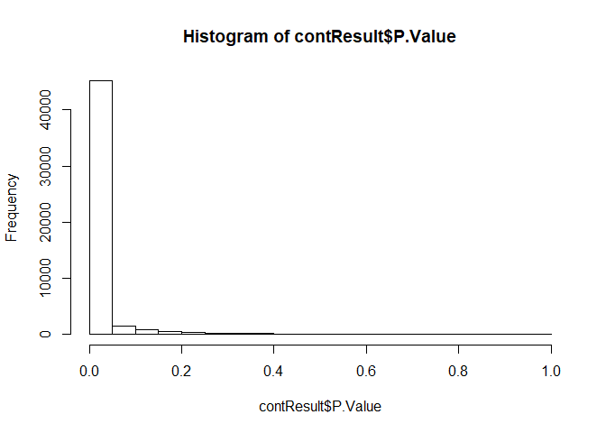

# Data and design  
`expr` is mRNA-seq TPM values, `libs` is metadata

```r
load("./Kate/expr.RData")
load("./Kate/libs.RData")
```


```r
libs$SPG_target <- ifelse(test = grepl(pattern = "GFP", x = libs$specimen_subset_external_id), yes = "ctrl", no = 
                                       ifelse(test = grepl(pattern = "OR", x = libs$specimen_subset_external_id), yes = "both", no =
                                                             ifelse(test = grepl(pattern = "143fix", x = libs$specimen_subset_external_id), yes = "miR143", no = 
                                                                      ifelse(test = grepl(pattern = "Xfix", x = libs$specimen_subset_external_id), yes = "miRX", no = "none"))))
```


```r
kable(libs)
```


library_name   sequencing_effort     platform_name   platform_version   specimen_subset_external_id   cohort_no   library_qc_info   index_sequence   SPG_target 
-------------  --------------------  --------------  -----------------  ----------------------------  ----------  ----------------  ---------------  -----------
A35856         AML PMP               ssRNA-Seq       v1                 UT-7                          Cohort 5    {'RIN': 9.8}      ATGTCA           none       
A54963         Karsan Lab Research   ssRNA-Seq       v1                 UT-7-GFP1                     Cohort 6    {}                CCCATG           ctrl       
A54964         Karsan Lab Research   ssRNA-Seq       v1                 UT-7-GFP2                     Cohort 6    {}                CTCAGA           ctrl       
A54965         Karsan Lab Research   ssRNA-Seq       v1                 UT-7-GFP3                     Cohort 6    {}                GCACTT           ctrl       
A54966         Karsan Lab Research   ssRNA-Seq       v1                 UT-7-OR-SPG1                  Cohort 6    {}                TATAAT           both       
A54967         Karsan Lab Research   ssRNA-Seq       v1                 UT-7-OR-SPG2                  Cohort 6    {}                TGCTGG           both       
A54968         Karsan Lab Research   ssRNA-Seq       v1                 UT-7-OR-SPG3                  Cohort 6    {}                CCGTCC           both       
A54969         Karsan Lab Research   ssRNA-Seq       v1                 UT-7-143fixSPG1               Cohort 6    {}                TGACCA           miR143     
A54970         Karsan Lab Research   ssRNA-Seq       v1                 UT-7-143fixSPG2               Cohort 6    {}                CTTGTA           miR143     
A54971         Karsan Lab Research   ssRNA-Seq       v1                 UT-7-143fixSPG3               Cohort 6    {}                AAGCGA           miR143     
A54972         Karsan Lab Research   ssRNA-Seq       v1                 UT-7-XfixSPG1                 Cohort 6    {}                ACTCTC           miRX       
A54973         Karsan Lab Research   ssRNA-Seq       v1                 UT-7-XfixSPG2                 Cohort 6    {}                ATACGG           miRX       
A54974         Karsan Lab Research   ssRNA-Seq       v1                 UT-7-XfixSPG3                 Cohort 6    {}                CACGAT           miRX       

## Quality control checks  

### First convert row names from column "Names":  

```r
expr2 <- column_to_rownames(expr, var = "Name")
```

```
## Warning: Setting row names on a tibble is deprecated.
```

```r
head(expr2)
```

```
## # A tibble: 6 x 13
##   A54974 A54963 A54964 A54966 A35856 A54971 A54972 A54973 A54967 A54969
##    <dbl>  <dbl>  <dbl>  <dbl>  <dbl>  <dbl>  <dbl>  <dbl>  <dbl>  <dbl>
## 1  0.173 0.0737  0.219  0.110 0.0383  0.171  0.157  0.231   0     0.281
## 2  0     0       0      0     0       0      0      0       0     0    
## 3  2.87  4.10    3.41   5.85  1.49    4.40   2.98   3.23    4.60  3.42 
## 4  0     0       0      0     0       0      0      0       0     0    
## 5  0     0       0      0     0       0      0      0       0     0    
## 6  0     0       0      0     0       0      0      0       0     0    
## # ... with 3 more variables: A54968 <dbl>, A54965 <dbl>, A54970 <dbl>
```


### Dimensions:   

```r
# expression data
dim(expr2)
```

```
## [1] 195480     13
```

```r
# metadata
dim(libs)
```

```
## [1] 13  9
```


### NA values:   

```r
any(is.na(expr2))
```

```
## [1] FALSE
```


### Range:  

```r
range(expr2)
```

```
## [1]      0.0 148169.7
```


```r
hist(as.matrix(expr2))
```

<!-- -->
Appears not to be log transformed.    


## Data transformation / row normalization  
### Log2 transformation  

```r
# log2 transformation with constant +0.01 added to allow transformation of zeros
expr.log <- log2(expr2 + 0.01)

# Visualize log transformed data
hist(as.matrix(expr.log))
```

<!-- -->
ASK: Why does this have so many 0 values? Is this normal for RNA-seq?  


# Limma
## Prep
### Check order of sample names and colnames in meta/expr

```r
order <- libs$library_name
expr2 <- expr2[,order]

identical(libs$library_name, colnames(expr2))
```

```
## [1] TRUE
```

### Make model matrix from metadata

```r
libs$SPG_target <- factor(libs$SPG_target, levels = c("ctrl", "miR143", "miRX", "both", "none"))
designMatrix <- model.matrix(~SPG_target, libs)

head(designMatrix)
```

```
##   (Intercept) SPG_targetmiR143 SPG_targetmiRX SPG_targetboth
## 1           1                0              0              0
## 2           1                0              0              0
## 3           1                0              0              0
## 4           1                0              0              0
## 5           1                0              0              1
## 6           1                0              0              1
##   SPG_targetnone
## 1              1
## 2              0
## 3              0
## 4              0
## 5              0
## 6              0
```

### Normalization and log transformation

```r
# convert to matrix
expr.matrix <- column_to_rownames(expr, var = "Name") %>%
  as.matrix()
```

```
## Warning: Setting row names on a tibble is deprecated.
```

```r
# filter out lowly expressed genes (keep: TPM must be >=1 in at least 2 samples)
thresh <- expr.matrix >= 1
keep <- rowSums(thresh) >=2

expr.matrix.keep <- expr.matrix[keep,]
dim(expr.matrix.keep)
```

```
## [1] 49697    13
```

```r
# convert to DGE list object and apply Normalization
dge <- DGEList(expr.matrix.keep)

dge.norm <- calcNormFactors(dge) # using default settings
head(dge.norm$counts) %>% kable()
```

                     A54974     A54963     A54964     A54966     A35856     A54971     A54972     A54973     A54967     A54969     A54968     A54965     A54970
----------------  ---------  ---------  ---------  ---------  ---------  ---------  ---------  ---------  ---------  ---------  ---------  ---------  ---------
ENST00000488147    2.870341   4.099234   3.408244   5.851605   1.493135   4.397266   2.983613   3.232376   4.603645   3.418479   4.786116   3.122282   2.779962
ENST00000494149    2.843703   4.584694   3.668867   5.149174   3.581911   5.183181   4.548439   4.289780   4.472369   3.280912   3.749748   4.034470   3.453580
ENST00000466557    0.636754   1.047331   0.627367   0.772683   0.451951   1.002096   0.972730   0.467456   0.869204   0.522553   0.523319   0.917518   1.196540
ENST00000410691    0.000000   2.019690   0.272814   0.000000   1.551503   0.000000   0.000000   0.604689   0.000000   0.000000   0.000000   0.000000   1.230365
ENST00000491962    1.004452   0.961366   0.655722   0.438947   0.451281   1.401859   0.438300   0.585667   0.000000   0.003700   0.690498   0.815021   0.981639
ENST00000623083    4.665235   5.128547   5.482258   6.733993   4.948131   5.702608   3.425517   5.127846   6.831190   5.417501   6.663883   5.159887   5.432365

```r
# log2 transform and check results
dge.log <- cpm(y = dge.norm, log = TRUE, normalized.lib.sizes = FALSE, lib.size = NA) # use the cpm function to log transform, but set other parameters to FALSE/NA to avoid taking "per million" since my values are already in TPM

head(dge.log) %>% kable()
```

                     A54974     A54963     A54964     A54966     A35856     A54971     A54972     A54973     A54967     A54969     A54968     A54965     A54970
----------------  ---------  ---------  ---------  ---------  ---------  ---------  ---------  ---------  ---------  ---------  ---------  ---------  ---------
ENST00000488147    2.303382   2.630731   2.455219   2.994331   1.829989   2.697478   2.337985   2.406673   2.744097   2.458048   2.784674   2.376417   2.278140
ENST00000494149    2.295476   2.741257   2.523092   2.859111   2.508424   2.864593   2.731900   2.672022   2.715130   2.420961   2.545510   2.612718   2.468350
ENST00000466557    1.419133   1.629145   1.414306   1.492456   1.316899   1.606532   1.592708   1.323524   1.541619   1.355657   1.356693   1.565070   1.697627
ENST00000410691    1.021071   2.028927   1.205358   1.021071   1.853993   1.021071   1.021071   1.401482   1.021071   1.021071   1.021071   1.021071   1.712814
ENST00000491962    1.607203   1.587833   1.429779   1.307395   1.316502   1.786766   1.306864   1.390924   1.021071   1.023735   1.449315   1.513533   1.597216
ENST00000623083    2.755694   2.855784   2.923368   3.147994   2.825012   2.965289   2.460539   2.852366   3.163416   2.910949   3.137193   2.859305   2.914980

```r
head(log2(dge.norm$counts + 0.25)) %>% kable() # reasonably similar to the result obtained with cpm function, which uses prior.count = 0.25 as default
```

                       A54974      A54963       A54964       A54966       A35856       A54971       A54972       A54973      A54967       A54969       A54968       A54965      A54970
----------------  -----------  ----------  -----------  -----------  -----------  -----------  -----------  -----------  ----------  -----------  -----------  -----------  ----------
ENST00000488147     1.6417037   2.1207613    1.8711513    2.6091888    0.8016843    2.2163822    1.6931470    1.8000720    2.279069    1.8751820    2.3323115    1.7537252   1.5992997
ENST00000494149     1.6293347   2.2734246    1.9704366    2.4327387    1.9380641    2.4417971    2.2625652    2.1826224    2.239511    1.8200409    1.9999091    2.0991168   1.8889205
ENST00000466557    -0.1733942   0.3755466   -0.1887477    0.0323590   -0.5105578    0.3243452    0.2901059   -0.4790377    0.162473   -0.3722942   -0.3708644    0.2234448   0.5326062
ENST00000410691    -2.0000000   1.1824953   -0.9356303   -2.0000000    0.8492011   -2.0000000   -2.0000000   -0.2265285   -2.000000   -2.0000000   -2.0000000   -2.0000000   0.5659529
ENST00000491962     0.3270573   0.2766348   -0.1428598   -0.5375351   -0.5119355    0.7240905   -0.5388906   -0.2589999   -2.000000   -1.9788046   -0.0885032    0.0908819   0.3005795
ENST00000623083     2.2972604   2.4272165    2.5191035    2.8040521    2.3779930    2.5735219    1.8779472    2.4270284    2.823992    2.5027127    2.7894962    2.4355985   2.5064915


## Perform linear modeling and statistics

```r
myfit <- lmFit(dge.log, design = designMatrix)
myfitEb <- eBayes(myfit, trend = TRUE) # trend analysis for RNA-seq data


# make contrast table for desired comparisons (each vs. ctrl)
myContrasts <- makeContrasts(m143_vs_ctrl = SPG_targetmiR143 - Intercept,
                             mX_vs_ctrl = SPG_targetmiRX - Intercept,
                             both_vs_ctrl = SPG_targetboth - Intercept,
                             none_vs_ctrl = SPG_targetnone - Intercept, levels = designMatrix)
```

```
## Warning in makeContrasts(m143_vs_ctrl = SPG_targetmiR143 - Intercept,
## mX_vs_ctrl = SPG_targetmiRX - : Renaming (Intercept) to Intercept
```

```r
# re-fit model with contrasts
contfit <- contrasts.fit(myfit, myContrasts) # I double checked and the names do match; the STAT540 seminar-4 tutorial also threw the same error message
```

```
## Warning in contrasts.fit(myfit, myContrasts): row names of contrasts don't
## match col names of coefficients
```

```r
contfitEb <- eBayes(contfit, trend = TRUE)

contResult <- topTable(contfitEb, number = Inf)

head(contResult) %>% kable()
```

                   m143_vs_ctrl   mX_vs_ctrl   both_vs_ctrl   none_vs_ctrl    AveExpr           F   P.Value   adj.P.Val
----------------  -------------  -----------  -------------  -------------  ---------  ----------  --------  ----------
ENST00000331825       -11.58455    -11.74639      -11.82715      -11.66583   11.54512   1075.5160         0           0
ENST00000368567       -11.90180    -11.97577      -11.72540      -11.62028   11.78790    806.5492         0           0
ENST00000321358       -10.45635    -10.43227      -10.79253      -10.88001   10.30096    721.4833         0           0
ENST00000270625       -12.11507    -12.13359      -12.23357      -12.14950   11.74703    675.0391         0           0
ENST00000368097       -10.23678    -10.33616      -10.40477      -10.55863   10.19027    619.5894         0           0
ENST00000361335       -13.89967    -13.88180      -14.21951      -14.19801   13.22285    617.7511         0           0

### QC: p-value histogram

```r
hist(contResult$P.Value)
```

<!-- -->

> NOTE: Too many low p-values???


## Identify differentially expressed genes in contrasts

```r
testResults <- decideTests(contfitEb, p.value = 1e-4, p.adjust.methods = "fdr", method = "global")

summary(testResults)
```

```
##        m143_vs_ctrl mX_vs_ctrl both_vs_ctrl none_vs_ctrl
## Down          28191      27280        28354        22364
## NotSig        21506      22417        21343        27333
## Up                0          0            0            0
```

> NOTE: A lot of genes are massively downregulated... there must be something wrong!


