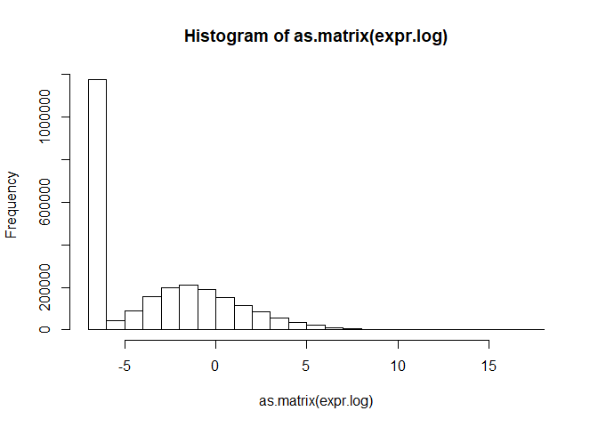

# Expression analysis for Kate's RNA-seq data
Jennifer Grants  
1/9/2019  


## Load saved data   
`expr` is mRNA-seq TPM values, `libs` is metadata

```r
load("./Kate/expr.RData")
load("./Kate/libs.RData")
```


```r
libs$SPG_target <- ifelse(test = grepl(pattern = "GFP", x = libs$specimen_subset_external_id), yes = "ctrl", no = 
                                       ifelse(test = grepl(pattern = "OR", x = libs$specimen_subset_external_id), yes = "both", no =
                                                             ifelse(test = grepl(pattern = "143fix", x = libs$specimen_subset_external_id), yes = "miR-143", no = 
                                                                      ifelse(test = grepl(pattern = "Xfix", x = libs$specimen_subset_external_id), yes = "miR-X", no = "none"))))
```


```r
kable(libs)
```


library_name   sequencing_effort     platform_name   platform_version   specimen_subset_external_id   cohort_no   library_qc_info   index_sequence   SPG_target 
-------------  --------------------  --------------  -----------------  ----------------------------  ----------  ----------------  ---------------  -----------
A35856         AML PMP               ssRNA-Seq       v1                 UT-7                          Cohort 5    {'RIN': 9.8}      ATGTCA           none       
A54963         Karsan Lab Research   ssRNA-Seq       v1                 UT-7-GFP1                     Cohort 6    {}                CCCATG           ctrl       
A54964         Karsan Lab Research   ssRNA-Seq       v1                 UT-7-GFP2                     Cohort 6    {}                CTCAGA           ctrl       
A54965         Karsan Lab Research   ssRNA-Seq       v1                 UT-7-GFP3                     Cohort 6    {}                GCACTT           ctrl       
A54966         Karsan Lab Research   ssRNA-Seq       v1                 UT-7-OR-SPG1                  Cohort 6    {}                TATAAT           both       
A54967         Karsan Lab Research   ssRNA-Seq       v1                 UT-7-OR-SPG2                  Cohort 6    {}                TGCTGG           both       
A54968         Karsan Lab Research   ssRNA-Seq       v1                 UT-7-OR-SPG3                  Cohort 6    {}                CCGTCC           both       
A54969         Karsan Lab Research   ssRNA-Seq       v1                 UT-7-143fixSPG1               Cohort 6    {}                TGACCA           miR-143    
A54970         Karsan Lab Research   ssRNA-Seq       v1                 UT-7-143fixSPG2               Cohort 6    {}                CTTGTA           miR-143    
A54971         Karsan Lab Research   ssRNA-Seq       v1                 UT-7-143fixSPG3               Cohort 6    {}                AAGCGA           miR-143    
A54972         Karsan Lab Research   ssRNA-Seq       v1                 UT-7-XfixSPG1                 Cohort 6    {}                ACTCTC           miR-X      
A54973         Karsan Lab Research   ssRNA-Seq       v1                 UT-7-XfixSPG2                 Cohort 6    {}                ATACGG           miR-X      
A54974         Karsan Lab Research   ssRNA-Seq       v1                 UT-7-XfixSPG3                 Cohort 6    {}                CACGAT           miR-X      

## Quality control checks  

### First convert row names from column "Names":  

```r
expr2 <- column_to_rownames(expr, var = "Name")
```

```
## Warning: Setting row names on a tibble is deprecated.
```

```r
head(expr2)
```

```
## # A tibble: 6 x 13
##   A54974 A54963 A54964 A54966 A35856 A54971 A54972 A54973 A54967 A54969
##    <dbl>  <dbl>  <dbl>  <dbl>  <dbl>  <dbl>  <dbl>  <dbl>  <dbl>  <dbl>
## 1  0.173 0.0737  0.219  0.110 0.0383  0.171  0.157  0.231   0     0.281
## 2  0     0       0      0     0       0      0      0       0     0    
## 3  2.87  4.10    3.41   5.85  1.49    4.40   2.98   3.23    4.60  3.42 
## 4  0     0       0      0     0       0      0      0       0     0    
## 5  0     0       0      0     0       0      0      0       0     0    
## 6  0     0       0      0     0       0      0      0       0     0    
## # ... with 3 more variables: A54968 <dbl>, A54965 <dbl>, A54970 <dbl>
```


### Dimensions:   

```r
# expression data
dim(expr2)
```

```
## [1] 195480     13
```

```r
# metadata
dim(libs)
```

```
## [1] 13  9
```


### NA values:   

```r
any(is.na(expr2))
```

```
## [1] FALSE
```


### Range:  

```r
range(expr2)
```

```
## [1]      0.0 148169.7
```


```r
hist(as.matrix(expr2))
```

<!-- -->
Appears not to be log transformed.    


## Data transformation / row normalization  
### Log2 transformation  

```r
# log2 transformation with constant +0.01 added to allow transformation of zeros
expr.log <- log2(expr2 + 0.01)

# Visualize log transformed data
hist(as.matrix(expr.log))
```

<!-- -->
ASK: Why does this have so many 0 values? Is this normal for RNA-seq?  


## DE-seq  

```r
design.table <- select(libs, library_name, SPG_target) %>%
  column_to_rownames(var = "library_name")
```

```
## Warning: Setting row names on a tibble is deprecated.
```

```r
expr.matrix <- column_to_rownames(expr, var = "Name") %>%
  select(rownames(design.table)) %>% # put columns in same order as the design matrix
  as.matrix()
```

```
## Warning: Setting row names on a tibble is deprecated.
```

```r
# filter to "highly expressed" genes
thresh <- expr.matrix >= 1
keep <- rowSums(thresh) >= 2 # keep rows where there are > 2 samples with tpm > 1

expr.matrix.keep <- expr.matrix[keep,]

# convert to integers for DEseq
int.matrix.keep <- round(expr.matrix.keep, digits = 0)

dds <- DESeqDataSetFromMatrix(countData = int.matrix.keep, colData = design.table, design = ~SPG_target)
```

```
## converting counts to integer mode
```

```
## Warning in DESeqDataSet(se, design = design, ignoreRank): some variables in
## design formula are characters, converting to factors
```

```r
res <- DESeq(dds)
```

```
## estimating size factors
```

```
## estimating dispersions
```

```
## gene-wise dispersion estimates
```

```
## mean-dispersion relationship
```

```
## final dispersion estimates
```

```
## fitting model and testing
```


### Summarise results by each SPG group  

#### miR-143 vs. ctrl  

```r
resultsNames(res)
```

```
## [1] "Intercept"         "SPG_targetboth"    "SPG_targetctrl"   
## [4] "SPG_targetmiR.143" "SPG_targetmiR.X"   "SPG_targetnone"
```

```r
result.pair <- results(res, contrast = c("SPG_target", "miR.143", "ctrl")) # contrast: the factor, then numerator, then denominator

kable(head(result.pair[which(result.pair$padj < 0.05),]))
```

                    baseMean   log2FoldChange       lfcSE        stat      pvalue        padj
----------------  ----------  ---------------  ----------  ----------  ----------  ----------
ENST00000379389     55.22855       -0.7644179   0.2442903   -3.129138   0.0017532   0.0352541
ENST00000444870     62.84878        0.7377248   0.2298670    3.209355   0.0013303   0.0288697
ENST00000376957    340.94471       -0.6291736   0.1478924   -4.254267   0.0000210   0.0013527
ENST00000616661     15.11767        2.3364114   0.5409216    4.319316   0.0000157   0.0010936
ENST00000375980     20.25668        1.2880441   0.3731420    3.451888   0.0005567   0.0154782
ENST00000375254     26.61497        1.4333930   0.3251651    4.408201   0.0000104   0.0007816

```r
write.csv(x = result.pair, file = "./Kate/DEseq/miR143_vs_ctrl.csv")
```


```r
# cutoffs: padj < 0.05, |FC| > 2
dat <- read.csv("./Kate/DEseq/miR143_vs_ctrl.csv") %>%
  mutate(Signif_p = -log10(padj) > -log10(0.05), 
         Signif_delta = abs(log2FoldChange) > log2(2),
         Signif = Signif_p == TRUE & Signif_delta == TRUE)

ggplot(dat, aes(log2FoldChange, -log10(padj))) +
  geom_point(aes(colour = Signif))
```

```
## Warning: Removed 40474 rows containing missing values (geom_point).
```

<!-- -->


#### miR-X vs ctrl  

```r
result.pair <- results(res, contrast = c("SPG_target", "miR.X", "ctrl")) # contrast: the factor, then numerator, then denominator

kable(head(result.pair[which(result.pair$padj < 0.05),]))
```

                     baseMean   log2FoldChange       lfcSE        stat      pvalue        padj
----------------  -----------  ---------------  ----------  ----------  ----------  ----------
ENST00000376957    340.944708       -0.6402111   0.1485135   -4.310795   0.0000163   0.0059842
ENST00000616661     15.117668        2.1413970   0.5440533    3.936006   0.0000828   0.0215420
ENST00000375254     26.614972        1.6091151   0.3238537    4.968649   0.0000007   0.0004853
ENST00000270792    585.158377        0.4779725   0.1305273    3.661858   0.0002504   0.0468939
ENST00000319041    602.213305        0.6097597   0.1181528    5.160773   0.0000002   0.0002143
ENST00000524432      4.271692        2.9579488   0.6938009    4.263397   0.0000201   0.0070417

```r
write.csv(x = result.pair, file = "./Kate/DEseq/miRX_vs_ctrl.csv")
```


```r
# cutoffs: padj < 0.05, |FC| > 2
dat <- read.csv("./Kate/DEseq/miRX_vs_ctrl.csv") %>%
  mutate(Signif_p = -log10(padj) > -log10(0.05), 
         Signif_delta = abs(log2FoldChange) > log2(2),
         Signif = Signif_p == TRUE & Signif_delta == TRUE)

ggplot(dat, aes(log2FoldChange, -log10(padj))) +
  geom_point(aes(colour = Signif))
```

```
## Warning: Removed 34 rows containing missing values (geom_point).
```

<!-- -->


#### Both vs ctrl  

```r
result.pair <- results(res, contrast = c("SPG_target", "both", "ctrl")) # contrast: the factor, then numerator, then denominator

kable(head(result.pair, 20)) # all p-values = 1, why??? Maybe the SPG didn't work to knock anything down? Maybe there was an outlier sample? ASK
```

                       baseMean   log2FoldChange       lfcSE         stat      pvalue   padj
----------------  -------------  ---------------  ----------  -----------  ----------  -----
ENST00000488147       3.4868792        0.5136559   0.6102379    0.8417307   0.3999387      1
ENST00000494149       4.0626438       -0.0091215   0.5994983   -0.0152151   0.9878605      1
ENST00000466557       0.8405221       -0.0066929   0.6952683   -0.0096264   0.9923194      1
ENST00000410691       0.4510725       -0.1732745   0.4121223   -0.4204443   0.6741609      1
ENST00000491962       0.6139997       -0.4409177   0.6390736   -0.6899326   0.4902365      1
ENST00000623083       5.3203599        0.3827929   0.5493490    0.6968118   0.4859206      1
ENST00000624735       1.6528961       -0.1457201   0.6916280   -0.2106915   0.8331280      1
ENST00000514436       0.7916598        0.3330299   0.6852433    0.4860024   0.6269655      1
ENST00000599771      12.8038757        0.1269599   0.3938008    0.3223964   0.7471524      1
ENST00000608420       1.4547964        0.3160217   0.7010694    0.4507710   0.6521546      1
ENST00000416931      68.6498706       -0.2607242   0.3023243   -0.8623990   0.3884680      1
ENST00000457540      98.9015427       -0.0501268   0.1920370   -0.2610269   0.7940718      1
ENST00000617238     291.3738525        0.2602736   0.3245026    0.8020694   0.4225128      1
ENST00000414273       7.6331097        0.1343469   0.4916868    0.2732367   0.7846712      1
ENST00000427426       4.0150084        0.1429441   0.5863173    0.2437999   0.8073858      1
ENST00000467115       1.8034461       -0.1894991   0.7034768   -0.2693750   0.7876411      1
ENST00000514057    1857.8623074        0.2281347   0.1282874    1.7783096   0.0753530      1
ENST00000416718       5.2267240        0.2195864   0.5387352    0.4075962   0.6835702      1
ENST00000506640       2.4797294        0.2056814   0.6520455    0.3154402   0.7524274      1
ENST00000411249       0.2440876        0.0000000   0.3976885    0.0000000   1.0000000      1

```r
write.csv(x = result.pair, file = "./Kate/DEseq/originalSPG_vs_ctrl.csv")
```


```r
# cutoffs: padj < 0.05, |FC| > 2
dat <- read.csv("./Kate/DEseq/originalSPG_vs_ctrl.csv") %>%
  mutate(Signif_p = -log10(padj) > -log10(0.05), 
         Signif_delta = abs(log2FoldChange) > log2(2),
         Signif = Signif_p == TRUE & Signif_delta == TRUE)

ggplot(dat, aes(log2FoldChange, -log10(padj))) +
  geom_point(aes(colour = Signif))
```

```
## Warning: Removed 34 rows containing missing values (geom_point).
```

<!-- -->

