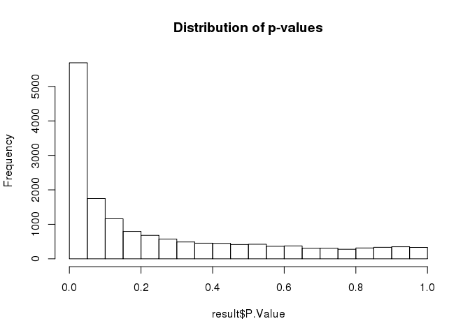

# Expression Analysis of TIRAP-oe vs. MIG-ctrl
Jennifer Grants  
2/6/2019  


# Expression data and design

```r
load("./TIRAP/expr.rda")
dim(expr) # should be 38215 rows according to RPKM.tsv
```

```
## [1] 38215     8
```

```r
load("./TIRAP/libs.rda")

head(expr) %>% kable()
```


gene_id              gene_symbol     A54933    A54934    A54935    A54936    A54937    A54938
-------------------  ------------  --------  --------  --------  --------  --------  --------
ENSMUSG00000000544   Gpa33           0.0000    0.0000    0.0121    0.0107    0.0000    0.0000
ENSMUSG00000000817   Fasl            0.0174    0.0129    0.0342    0.0000    0.0083    0.0000
ENSMUSG00000001138   Cnnm3           4.9831    5.3761    5.1055    4.4783    4.5696    4.4782
ENSMUSG00000001143   Lman2l          5.5133    5.6463    6.1655    6.0378    6.1402    5.6661
ENSMUSG00000001305   Rrp15          21.6306   24.1587   19.7010   19.1657   13.1051   16.7197
ENSMUSG00000001674   Ddx18          12.2045   13.7941   12.5095   11.8213    9.6193   11.0575

```r
head(libs) %>% kable()
```


library_name   sequencing_effort     platform_name   platform_version   specimen_subset_external_id   cohort_no   library_qc_info   index_sequence 
-------------  --------------------  --------------  -----------------  ----------------------------  ----------  ----------------  ---------------
A54933         Karsan Lab Research   ssRNA-Seq       v1                 MIG-1                         Cohort 6    {}                ATCACG         
A54934         Karsan Lab Research   ssRNA-Seq       v1                 MIG-2                         Cohort 6    {}                GATCAG         
A54935         Karsan Lab Research   ssRNA-Seq       v1                 MIG-3                         Cohort 6    {}                AACCCC         
A54936         Karsan Lab Research   ssRNA-Seq       v1                 TIRAP-1                       Cohort 6    {}                ACCCAG         
A54937         Karsan Lab Research   ssRNA-Seq       v1                 TIRAP-2                       Cohort 6    {}                AGCGCT         
A54938         Karsan Lab Research   ssRNA-Seq       v1                 TIRAP-3                       Cohort 6    {}                CAAAAG         

## QC plot

```r
column_to_rownames(expr, var = "gene_id") %>%
  select(-gene_symbol) %>%
  as.matrix() %>%
  log2() %>%
  hist(main = "log2(Expression)") 
```

```
## Warning: Setting row names on a tibble is deprecated.
```

<!-- -->

# Proof-of-concept: Expression of cytokines/alarmins (see if it matches with Rawa's previous graph)
## Reformat data for ggplot2

```r
# melt data to allow graphing
## using all data (no filtering for expression levels) to avoid leaving out things that were considered in previous analysis
library(reshape2)
```

```
## 
## Attaching package: 'reshape2'
```

```
## The following object is masked from 'package:tidyr':
## 
##     smiths
```

```r
expr.melt <- as.data.frame(expr) %>%
  select(gene_symbol, contains("A54")) %>%
  melt(id.vars = "gene_symbol", variable.name = "sample", value.name = "expression")

# create a factor for experimental design
design <- select(libs, library_name, specimen_subset_external_id) %>%
  rename(specimen = specimen_subset_external_id) %>%
  mutate(oe = specimen) %>%
  separate(col = oe, into = "construct", remove = T)
```

```
## Warning: Expected 1 pieces. Additional pieces discarded in 6 rows [1, 2, 3,
## 4, 5, 6].
```

```r
expr.melt$construct <- design[match(expr.melt$sample, design$library_name),]$construct

head(expr.melt)
```

```
##   gene_symbol sample expression construct
## 1       Gpa33 A54933     0.0000       MIG
## 2        Fasl A54933     0.0174       MIG
## 3       Cnnm3 A54933     4.9831       MIG
## 4      Lman2l A54933     5.5133       MIG
## 5       Rrp15 A54933    21.6306       MIG
## 6       Ddx18 A54933    12.2045       MIG
```

## Select genes of interest based on Aparna's lab meeting 2019-01-22, slide 9
(Plus a few extras...)

```r
genes.of.int <- c("Il1b", "Il6", "Il10", "Il-12", "Tnf", "Ifnb1", "Ifng", "Cxcl10", "Csf2", "Il2ra", "Fasl", "Ifngr1", "Ifngr2", "Il10ra", "Il10rb")

int <- filter(expr.melt, gene_symbol %in% genes.of.int)

summary_int <- group_by(int, gene_symbol, construct) %>%
  summarise(mean = mean(expression), sd = sd(expression), n = length(expression))

ggplot(summary_int, aes(gene_symbol, mean, fill = construct)) +
  geom_bar(stat = "identity", colour = "black", width = 0.6, position = "dodge") +
  geom_errorbar(aes(ymin = mean, ymax = mean+(sd/sqrt(n))), width = 0.3, position=position_dodge(.6)) +
  scale_y_continuous(expand = c(0,0), limits = c(NA, 100))
```

<!-- -->

* Ask Aparna: Is the graph from lab meeting a qPCR result or a RNA-seq summary? The trend is same direction for all genes, but expression levels & effect size are very different...
    - note: The Y axis in lab meeting graph is "Relative Expression", which likely means qPCR


# Prep for limma analysis
## Processing expression data

```r
expr.matrix <- column_to_rownames(expr, var = "gene_id") %>%
  select(-gene_symbol) %>%
  as.matrix()
```

```
## Warning: Setting row names on a tibble is deprecated.
```

```r
# filter to 'higher' expressed genes (RPKM >= 0.1 in at least 3 samples)
thresh <- expr.matrix >= 0.1
keep <- rowSums(thresh) >= 3

expr.matrix.keep <- expr.matrix[keep,]

# normalization
dge <- DGEList(expr.matrix.keep)

dge.norm <- calcNormFactors(dge)

# log2 transformation
dge.log <- cpm(dge.norm, normalized.lib.sizes = FALSE, lib.size = NA, log = TRUE, prior.count = 0.01) # prior.count changes the addition term for log2 transformation

head(dge.log) %>% kable()
```

                        A54933     A54934     A54935     A54936     A54937     A54938
-------------------  ---------  ---------  ---------  ---------  ---------  ---------
ENSMUSG00000001138    3.499360   3.607360   3.553564   3.365813   3.428251   3.337835
ENSMUSG00000001143    3.644952   3.677976   3.825247   3.796059   3.853685   3.676588
ENSMUSG00000001305    5.615071   5.773165   5.499626   5.460863   4.946242   5.236002
ENSMUSG00000001674    4.789931   4.965127   4.844800   4.764190   4.500505   4.639926
ENSMUSG00000002881    5.266723   5.114390   5.416268   5.650939   5.619563   5.674435
ENSMUSG00000003134    4.283649   4.320456   4.352434   4.177297   4.456001   4.227860

## Make design matrix

```r
# Model matrix
designMatrix <- model.matrix(~construct, design)

kable(designMatrix)
```


 (Intercept)   constructTIRAP
------------  ---------------
           1                0
           1                0
           1                0
           1                1
           1                1
           1                1


# Limma analysis
## Top table

```r
fit <- lmFit(dge.log, design = designMatrix)
fitEb <- eBayes(fit)

result <- topTable(fitEb, number = Inf)
```

```
## Removing intercept from test coefficients
```

```r
head(result, 10)
```

```
##                       logFC    AveExpr        t      P.Value    adj.P.Val
## ENSMUSG00000085949 9.562982 -0.6690770 53.63890 8.129529e-09 7.748386e-05
## ENSMUSG00000070645 5.043735 -2.9287002 50.61614 1.124646e-08 7.748386e-05
## ENSMUSG00000024529 6.018361  1.7048320 48.25675 1.468888e-08 7.748386e-05
## ENSMUSG00000024397 5.034768  3.4409016 43.67735 2.565371e-08 1.014925e-04
## ENSMUSG00000063157 6.493909 -2.2036133 40.43854 3.946332e-08 1.024977e-04
## ENSMUSG00000004730 3.119105  6.9080396 39.89361 4.257178e-08 1.024977e-04
## ENSMUSG00000001348 4.125753  4.6477775 39.44660 4.533865e-08 1.024977e-04
## ENSMUSG00000061132 4.774440  1.3503993 38.13689 5.475222e-08 1.083067e-04
## ENSMUSG00000052188 6.149275 -2.3759303 36.51489 6.979691e-08 1.227262e-04
## ENSMUSG00000039116 5.618718 -0.7195449 33.64976 1.101471e-07 1.743078e-04
##                            B
## ENSMUSG00000085949 10.271366
## ENSMUSG00000070645 10.100870
## ENSMUSG00000024529  9.952354
## ENSMUSG00000024397  9.618134
## ENSMUSG00000063157  9.337758
## ENSMUSG00000004730  9.286416
## ENSMUSG00000001348  9.243329
## ENSMUSG00000061132  9.111823
## ENSMUSG00000052188  8.937331
## ENSMUSG00000039116  8.593782
```


```r
write.csv(result, "./TIRAP/Limma/Limma_result_TIRAPvsMIG.csv")
```

### QC: p-value distribution

```r
hist(result$P.Value, main = "Distribution of p-values")
```

<!-- -->


## Heatmap of significantly differentially expressed genes

```r
cutoff <- 0.05

signif <- decideTests(fitEb, p.value = cutoff, p.adjust.methods = "fdr", method = "global")
summary(signif)
```

```
##    (Intercept) constructTIRAP
## -1        1705           2245
## 0         1343          11145
## 1        12777           2435
```

```r
hits <- as.data.frame(signif) %>%
  rownames_to_column(var = "gene") %>%
  filter(constructTIRAP != 0)

hits.log.expr <- dge.log[which(rownames(dge.log) %in% hits$gene),]

hits.scaled <- t(hits.log.expr) %>% scale() %>% (t)
```


```r
heatmap_pallete <- colorRampPalette(brewer.pal(8, name = "RdBu"))(21) %>% rev

anno.frame <- data.frame(sample.name = colnames(hits.scaled), Construct = design[match(colnames(hits.scaled), design$library_name),]$construct) %>%
  column_to_rownames(var = "sample.name")

pheatmap(hits.scaled, 
         cluster_cols = F, 
         cluster_rows = T, 
         show_rownames = F, 
         clustering_method = "ward.D2", 
         clustering_distance_cols = "euclidean", 
         annotation_col = anno.frame, 
         color = heatmap_pallete)
```

<!-- -->

## Heatmap of top 50 up and top 50 down genes with names

Prep for making heatmap with gene names:  

```r
# top upregulated
up <- as.data.frame(signif) %>%
  rownames_to_column(var = "gene") %>%
  filter(constructTIRAP > 0)

up_result <- result[which(rownames(result) %in% up$gene),] %>%
  rownames_to_column(var = "gene") %>%
  arrange(adj.P.Val) %>%
  head(50)

up.log.expr <- dge.log[which(rownames(dge.log) %in% up_result$gene),]
up.scaled <- t(up.log.expr) %>% scale() %>% (t)

# top downregulated
down <- as.data.frame(signif) %>%
  rownames_to_column(var = "gene") %>%
  filter(constructTIRAP < 0)

down_result <- result[which(rownames(result) %in% down$gene),] %>%
  rownames_to_column(var = "gene") %>%
  arrange(adj.P.Val) %>%
  head(50)

down.log.expr <- dge.log[which(rownames(dge.log) %in% down_result$gene),]
down.scaled <- t(down.log.expr) %>% scale() %>% (t)

# convert to gene symbol using Jenny's pre-derived gene_symbol column
up.scaled <- as.data.frame(up.scaled) %>%
  rownames_to_column(var = "gene_id")
down.scaled <- as.data.frame(down.scaled) %>%
  rownames_to_column(var = "gene_id")

up.scaled$gene_symbol <- expr[match(up.scaled$gene_id, expr$gene_id),]$gene_symbol
down.scaled$gene_symbol <- expr[match(down.scaled$gene_id, expr$gene_id),]$gene_symbol

up.scaled <- dplyr::select(up.scaled, -gene_id) %>%
  column_to_rownames(var = "gene_symbol")

down.scaled <- dplyr::select(down.scaled, -gene_id) %>%
  column_to_rownames(var = "gene_symbol")

scaled.50.50 <- rbind(up.scaled, down.scaled)
```

Draw heatmap:  

```r
pheatmap(scaled.50.50, 
         cluster_cols = F, 
         cluster_rows = T, 
         show_rownames = T, 
         clustering_method = "ward.D2", 
         clustering_distance_cols = "euclidean", 
         annotation_col = anno.frame, 
         color = heatmap_pallete)
```

<!-- -->


# Prepare data for GSEA analysis (expression analysis)
## Convert to human gene names  

```r
library(biomaRt)
mouse <- useMart("ENSEMBL_MART_ENSEMBL", "mmusculus_gene_ensembl")
human <- useMart("ENSEMBL_MART_ENSEMBL", "hsapiens_gene_ensembl")

orthologs <- getBM(attributes = c("ensembl_gene_id", "hsapiens_homolog_ensembl_gene"), filters = "ensembl_gene_id", values = rownames(expr.matrix.keep), mart = mouse) # using "higher" expressed genes only, in expr.matrix.keep

hgnc <- getBM(attributes = c("ensembl_gene_id", "hgnc_symbol"), filters = "ensembl_gene_id", values = orthologs$hsapiens_homolog_ensembl_gene, mart = human)

# Add human gene IDs and names to expr.matrix.keep (using "higher" expressed genes only to avoid including a whole bunch of crap)
expr.matrix.keep <- as.data.frame(expr.matrix.keep) %>%
  rownames_to_column(var = "gene_id")
expr.matrix.keep$human_gene_id <- orthologs[match(expr.matrix.keep$gene_id, orthologs$ensembl_gene_id),]$hsapiens_homolog_ensembl_gene
expr.matrix.keep$hgnc_name <- hgnc[match(expr.matrix.keep$human_gene_id, hgnc$ensembl_gene_id),]$hgnc_symbol
  # also add mouse names to double check fidelity of conversion to human
mgi <- getBM(attributes = c("ensembl_gene_id", "mgi_symbol"), filters = "ensembl_gene_id", values = expr.matrix.keep$gene_id, mart = mouse)
expr.matrix.keep$mgi_name <- mgi[match(expr.matrix.keep$gene_id, mgi$ensembl_gene_id),]$mgi_symbol # looks good

head(expr.matrix.keep) %>% kable()
```


gene_id                A54933    A54934    A54935    A54936    A54937    A54938  human_gene_id     hgnc_name   mgi_name 
-------------------  --------  --------  --------  --------  --------  --------  ----------------  ----------  ---------
ENSMUSG00000001138     4.9831    5.3761    5.1055    4.4783    4.5696    4.4782  ENSG00000168763   CNNM3       Cnnm3    
ENSMUSG00000001143     5.5133    5.6463    6.1655    6.0378    6.1402    5.6661  ENSG00000114988   LMAN2L      Lman2l   
ENSMUSG00000001305    21.6306   24.1587   19.7010   19.1657   13.1051   16.7197  ENSG00000067533   RRP15       Rrp15    
ENSMUSG00000001674    12.2045   13.7941   12.5095   11.8213    9.6193   11.0575  ENSG00000088205   DDX18       Ddx18    
ENSMUSG00000002881    16.9883   15.2988   18.5944   21.8661   20.9050   22.6610  ENSG00000138386   NAB1        Nab1     
ENSMUSG00000003134     8.5894    8.8196    8.8896    7.8670    9.3268    8.3077  ENSG00000204634   TBC1D8      Tbc1d8   

## Make expression dataset

```r
eset.keep <- mutate(expr.matrix.keep, DESCRIPTION = "na") %>%
  rename(NAME = hgnc_name) %>%
  dplyr::select(NAME, DESCRIPTION, contains("A54")) %>%
  filter(!is.na(NAME), NAME != "")

# write to .txt with tab sep for GSEA
write.table(x = eset.keep, file = "./TIRAP/GSEA_fromLimma/TIRAP_exprSet_filteredForHighExpression.txt", sep = "\t", row.names = F, quote = F)
```


## Make .cls file

```r
# check that sample names are in same order on design frame and eset.keep
identical(colnames(eset.keep[,3:8]), design$library_name, attrib.as.set = T)
```

```
## [1] TRUE
```

```r
# .cls file rows
numbers <- c(nrow(design), length(unique(design$construct)), 1) # 1st line of .cls file: samples, groups, (always 1)

names <- c("#", unique(design$construct)) %>% unlist() # 2nd line of .cls file: #symbol + names of groups

groups <- unlist(design$construct) # 3rd line of .cls file: group assignment of each sample (in the same order as colnames in exprset)

# combine into 1 .cls file
write(x = numbers, file = "./TIRAP/GSEA_fromLimma/Phenotypes_TIRAP.cls", ncolumns = length(numbers))
write(x = names, file = "./TIRAP/GSEA_fromLimma/Phenotypes_TIRAP.cls", ncolumns = length(names), append = TRUE)
write(x = groups, file = "./TIRAP/GSEA_fromLimma/Phenotypes_TIRAP.cls", ncolumns = length(groups), append = TRUE)
```

> Ready to do GSEA and EnrichmentMap analysis
