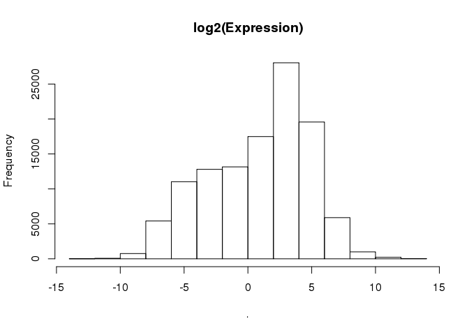
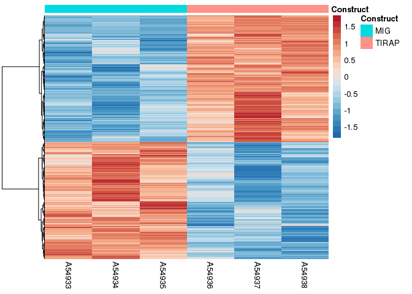

# Expression Analysis of TIRAP-oe vs. MIG-ctrl
Jennifer Grants  
2/6/2019  


# Expression data and design

```r
load("./TIRAP/expr.rda")
load("./TIRAP/libs.rda")

head(expr) %>% kable()
```


gene_id                A54933    A54934    A54935    A54936    A54937    A54938
-------------------  --------  --------  --------  --------  --------  --------
ENSMUSG00000000544     0.0000    0.0000    0.0121    0.0107    0.0000    0.0000
ENSMUSG00000000817     0.0174    0.0129    0.0342    0.0000    0.0083    0.0000
ENSMUSG00000001138     4.9831    5.3761    5.1055    4.4783    4.5696    4.4782
ENSMUSG00000001143     5.5133    5.6463    6.1655    6.0378    6.1402    5.6661
ENSMUSG00000001305    21.6306   24.1587   19.7010   19.1657   13.1051   16.7197
ENSMUSG00000001674    12.2045   13.7941   12.5095   11.8213    9.6193   11.0575

```r
head(libs) %>% kable()
```


library_name   sequencing_effort     platform_name   platform_version   specimen_subset_external_id   cohort_no   library_qc_info   index_sequence 
-------------  --------------------  --------------  -----------------  ----------------------------  ----------  ----------------  ---------------
A54933         Karsan Lab Research   ssRNA-Seq       v1                 MIG-1                         Cohort 6    {}                ATCACG         
A54934         Karsan Lab Research   ssRNA-Seq       v1                 MIG-2                         Cohort 6    {}                GATCAG         
A54935         Karsan Lab Research   ssRNA-Seq       v1                 MIG-3                         Cohort 6    {}                AACCCC         
A54936         Karsan Lab Research   ssRNA-Seq       v1                 TIRAP-1                       Cohort 6    {}                ACCCAG         
A54937         Karsan Lab Research   ssRNA-Seq       v1                 TIRAP-2                       Cohort 6    {}                AGCGCT         
A54938         Karsan Lab Research   ssRNA-Seq       v1                 TIRAP-3                       Cohort 6    {}                CAAAAG         

## QC plot

```r
column_to_rownames(expr, var = "gene_id") %>%
  as.matrix() %>%
  log2() %>%
  hist(main = "log2(Expression)")
```

<!-- -->


## Processing expression data

```r
expr.matrix <- column_to_rownames(expr, var = "gene_id") %>%
  as.matrix()

# filter to 'higher' expressed genes (RPKM >= 0.1 in at least 3 samples)
thresh <- expr.matrix >= 0.1
keep <- rowSums(thresh) >= 3

expr.matrix.keep <- expr.matrix[keep,]

# normalization
dge <- DGEList(expr.matrix.keep)

dge.norm <- calcNormFactors(dge)

# log2 transformation
dge.log <- cpm(dge.norm, normalized.lib.sizes = FALSE, lib.size = NA, log = TRUE, prior.count = 0.01) # prior.count changes the addition term for log2 transformation

head(dge.log) %>% kable()
```

                        A54933     A54934     A54935     A54936     A54937     A54938
-------------------  ---------  ---------  ---------  ---------  ---------  ---------
ENSMUSG00000001138    4.332841   4.442327   4.372112   4.198099   4.266315   4.165721
ENSMUSG00000001143    4.478434   4.512944   4.643790   4.628345   4.691753   4.504473
ENSMUSG00000001305    6.448557   6.608138   6.318156   6.293151   5.784316   6.063883
ENSMUSG00000001674    5.623415   5.800098   5.663334   5.596478   5.338578   5.467809
ENSMUSG00000002881    6.100208   5.949362   6.234799   6.483228   6.457639   6.502316
ENSMUSG00000003134    5.117132   5.155426   5.170972   5.009584   5.294073   5.055743

## Make design matrix

```r
# First create a factor for experimental design
design <- select(libs, library_name, specimen_subset_external_id) %>%
  rename(specimen = specimen_subset_external_id) %>%
  mutate(oe = specimen) %>%
  separate(col = oe, into = "construct", remove = T)
```

```
## Warning: Expected 1 pieces. Additional pieces discarded in 6 rows [1, 2, 3,
## 4, 5, 6].
```

```r
# Model matrix
designMatrix <- model.matrix(~construct, design)

kable(designMatrix)
```


 (Intercept)   constructTIRAP
------------  ---------------
           1                0
           1                0
           1                0
           1                1
           1                1
           1                1


# Limma analysis
## Top table

```r
fit <- lmFit(dge.log, design = designMatrix)
fitEb <- eBayes(fit)

result <- topTable(fitEb, number = Inf)
```

```
## Removing intercept from test coefficients
```

```r
head(result, 10)
```

```
##                       logFC    AveExpr        t      P.Value    adj.P.Val
## ENSMUSG00000085949 9.564891  0.1627141 54.17258 8.295278e-09 6.258842e-05
## ENSMUSG00000070645 5.045598 -2.0969323 49.63205 1.350489e-08 6.258842e-05
## ENSMUSG00000024397 5.038501  4.2717836 44.47621 2.486511e-08 7.682489e-05
## ENSMUSG00000063157 6.495796 -1.3718337 40.70032 4.073029e-08 7.954061e-05
## ENSMUSG00000061132 4.778143  2.1812936 39.24476 4.987301e-08 7.954061e-05
## ENSMUSG00000004730 3.122858  7.7389124 39.02043 5.148815e-08 7.954061e-05
## ENSMUSG00000070702 7.413949 -0.9127572 30.76617 1.927868e-07 2.463041e-04
## ENSMUSG00000032356 4.735878 -2.2517927 29.54964 2.411484e-07 2.463041e-04
## ENSMUSG00000049037 3.597316  7.8630533 28.56586 2.909601e-07 2.463041e-04
## ENSMUSG00000035356 2.420220  5.1038647 28.41309 2.997407e-07 2.463041e-04
##                            B
## ENSMUSG00000085949 10.191852
## ENSMUSG00000070645  9.938929
## ENSMUSG00000024397  9.586995
## ENSMUSG00000063157  9.273776
## ENSMUSG00000061132  9.137896
## ENSMUSG00000004730  9.116125
## ENSMUSG00000070702  8.125639
## ENSMUSG00000032356  7.941445
## ENSMUSG00000049037  7.783544
## ENSMUSG00000035356  7.758266
```


```r
write.csv(result, "./TIRAP/Limma/Limma_result_TIRAPvsMIG.csv")
```

### QC: p-value distribution

```r
hist(result$P.Value, main = "Distribution of p-values")
```

<!-- -->


## Heatmap of significantly differentially expressed genes

```r
cutoff <- 0.05

signif <- decideTests(fitEb, p.value = cutoff, p.adjust.methods = "fdr", method = "global")
summary(signif)
```

```
##    (Intercept) constructTIRAP
## -1         471           1163
## 0          928           6676
## 1         7870           1430
```

```r
hits <- as.data.frame(signif) %>%
  rownames_to_column(var = "gene") %>%
  filter(constructTIRAP != 0)

hits.log.expr <- dge.log[which(rownames(dge.log) %in% hits$gene),]

hits.scaled <- t(hits.log.expr) %>% scale() %>% (t)
```


```r
heatmap_pallete <- colorRampPalette(brewer.pal(8, name = "RdBu"))(21) %>% rev

anno.frame <- data.frame(sample.name = colnames(hits.scaled), Construct = design[match(colnames(hits.scaled), design$library_name),]$construct) %>%
  column_to_rownames(var = "sample.name")

pheatmap(hits.scaled, 
         cluster_cols = F, 
         cluster_rows = T, 
         show_rownames = F, 
         clustering_method = "ward.D2", 
         clustering_distance_cols = "euclidean", 
         annotation_col = anno.frame, 
         color = heatmap_pallete)
```

<!-- -->

## Heatmap of top 50 up and top 50 down genes with names

Prep for making heatmap with gene names:  

```r
# top upregulated
up <- as.data.frame(signif) %>%
  rownames_to_column(var = "gene") %>%
  filter(constructTIRAP > 0)

up_result <- result[which(rownames(result) %in% up$gene),] %>%
  rownames_to_column(var = "gene") %>%
  arrange(adj.P.Val) %>%
  head(50)

up.log.expr <- dge.log[which(rownames(dge.log) %in% up_result$gene),]
up.scaled <- t(up.log.expr) %>% scale() %>% (t)

# top downregulated
down <- as.data.frame(signif) %>%
  rownames_to_column(var = "gene") %>%
  filter(constructTIRAP < 0)

down_result <- result[which(rownames(result) %in% down$gene),] %>%
  rownames_to_column(var = "gene") %>%
  arrange(adj.P.Val) %>%
  head(50)

down.log.expr <- dge.log[which(rownames(dge.log) %in% down_result$gene),]
down.scaled <- t(down.log.expr) %>% scale() %>% (t)

# biomart gene name conversion to mgi symbol
library(biomaRt)

mouse <- useMart(biomart = "ENSEMBL_MART_ENSEMBL", dataset = "mmusculus_gene_ensembl")
genenames_up <- getBM(attributes = c("ensembl_gene_id", "mgi_symbol"), filters = "ensembl_gene_id", values = rownames(up.scaled), mart = mouse)
genenames_down <- getBM(attributes = c("ensembl_gene_id", "mgi_symbol"), filters = "ensembl_gene_id", values = rownames(down.scaled), mart = mouse)

up.scaled <- as.data.frame(up.scaled) %>%
  rownames_to_column(var = "gene_id")
down.scaled <- as.data.frame(down.scaled) %>%
  rownames_to_column(var = "gene_id")

up.scaled$gene <- genenames_up[match(up.scaled$gene_id, genenames_up$ensembl_gene_id),]$mgi_symbol
down.scaled$gene <- genenames_down[match(down.scaled$gene_id, genenames_down$ensembl_gene_id),]$mgi_symbol

up.scaled <- dplyr::select(up.scaled, -gene_id) %>%
  column_to_rownames(var = "gene")

down.scaled <- dplyr::select(down.scaled, -gene_id) %>%
  filter(!is.na(gene)) %>%
  column_to_rownames(var = "gene")

scaled.50.50 <- rbind(up.scaled, down.scaled)
```

Draw heatmap:  

```r
pheatmap(scaled.50.50, 
         cluster_cols = F, 
         cluster_rows = T, 
         show_rownames = T, 
         clustering_method = "ward.D2", 
         clustering_distance_cols = "euclidean", 
         annotation_col = anno.frame, 
         color = heatmap_pallete)
```

<!-- -->


# Prepare data for GSEA analysis (expression analysis)
## Convert to human gene names  

```r
human <- useMart("ENSEMBL_MART_ENSEMBL", "hsapiens_gene_ensembl")

orthologs <- getBM(attributes = c("ensembl_gene_id", "hsapiens_homolog_ensembl_gene"), filters = "ensembl_gene_id", values = rownames(expr.matrix.keep), mart = mouse) # using "higher" expressed genes only, in expr.matrix.keep

hgnc <- getBM(attributes = c("ensembl_gene_id", "hgnc_symbol"), filters = "ensembl_gene_id", values = orthologs$hsapiens_homolog_ensembl_gene, mart = human)

# Add human gene IDs and names to expr.matrix.keep (using "higher" expressed genes only to avoid including a whole bunch of crap)
expr.matrix.keep <- as.data.frame(expr.matrix.keep) %>%
  rownames_to_column(var = "gene_id")
expr.matrix.keep$human_gene_id <- orthologs[match(expr.matrix.keep$gene_id, orthologs$ensembl_gene_id),]$hsapiens_homolog_ensembl_gene
expr.matrix.keep$hgnc_name <- hgnc[match(expr.matrix.keep$human_gene_id, hgnc$ensembl_gene_id),]$hgnc_symbol
  # also add mouse names to double check fidelity of conversion to human
mgi <- getBM(attributes = c("ensembl_gene_id", "mgi_symbol"), filters = "ensembl_gene_id", values = expr.matrix.keep$gene_id, mart = mouse)
expr.matrix.keep$mgi_name <- mgi[match(expr.matrix.keep$gene_id, mgi$ensembl_gene_id),]$mgi_symbol # looks good

head(expr.matrix.keep) %>% kable()
```


gene_id                A54933    A54934    A54935    A54936    A54937    A54938  human_gene_id     hgnc_name   mgi_name 
-------------------  --------  --------  --------  --------  --------  --------  ----------------  ----------  ---------
ENSMUSG00000001138     4.9831    5.3761    5.1055    4.4783    4.5696    4.4782  ENSG00000168763   CNNM3       Cnnm3    
ENSMUSG00000001143     5.5133    5.6463    6.1655    6.0378    6.1402    5.6661  ENSG00000114988   LMAN2L      Lman2l   
ENSMUSG00000001305    21.6306   24.1587   19.7010   19.1657   13.1051   16.7197  ENSG00000067533   RRP15       Rrp15    
ENSMUSG00000001674    12.2045   13.7941   12.5095   11.8213    9.6193   11.0575  ENSG00000088205   DDX18       Ddx18    
ENSMUSG00000002881    16.9883   15.2988   18.5944   21.8661   20.9050   22.6610  ENSG00000138386   NAB1        Nab1     
ENSMUSG00000003134     8.5894    8.8196    8.8896    7.8670    9.3268    8.3077  ENSG00000204634   TBC1D8      Tbc1d8   

## Make expression dataset

```r
eset.keep <- mutate(expr.matrix.keep, DESCRIPTION = "na") %>%
  rename(NAME = hgnc_name) %>%
  dplyr::select(NAME, DESCRIPTION, contains("A54")) %>%
  filter(!is.na(NAME), NAME != "")

# write to .txt with tab sep for GSEA
write.table(x = eset.keep, file = "./TIRAP/GSEA_fromLimma/TIRAP_exprSet_filteredForHighExpression.txt", sep = "\t", row.names = F, quote = F)
```


## Make .cls file

```r
# check that sample names are in same order on design frame and eset.keep
identical(colnames(eset.keep[,3:8]), design$library_name, attrib.as.set = T)
```

```
## [1] TRUE
```

```r
# .cls file rows
numbers <- c(nrow(design), length(unique(design$construct)), 1) # 1st line of .cls file: samples, groups, (always 1)

names <- c("#", unique(design$construct)) %>% unlist() # 2nd line of .cls file: #symbol + names of groups

groups <- unlist(design$construct) # 3rd line of .cls file: group assignment of each sample (in the same order as colnames in exprset)

# combine into 1 .cls file
write(x = numbers, file = "./TIRAP/GSEA_fromLimma/Phenotypes_TIRAP.cls", ncolumns = length(numbers))
write(x = names, file = "./TIRAP/GSEA_fromLimma/Phenotypes_TIRAP.cls", ncolumns = length(names), append = TRUE)
write(x = groups, file = "./TIRAP/GSEA_fromLimma/Phenotypes_TIRAP.cls", ncolumns = length(groups), append = TRUE)
```

> Ready to do GSEA and EnrichmentMap analysis


