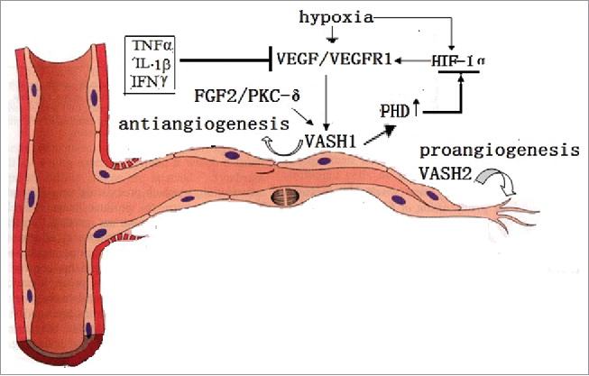

```{r setup, include=FALSE}
knitr::opts_chunk$set(echo = TRUE)
library(tidyverse)
library(knitr)
```

> Goal: To explore how TIRAP-oe BM inhibits endothelial cell function

* Conversation with Aparna 2019-02-08:  
    - Endothelial cell function is disrupted in TIRAP-oe BMT
    - Rawa previously investigated HMGB1 (alarmin) secretion, which triggers pyroptosis. Unbiased data supporting this line of investigation was weak (IPA analysis where HMGB1 pathway showed up very far down the list).
    - What secreted proteins released by TIRAP-oe BM could trigger endothelial cell dysfunction?
    
# Gene set for endothelial cell GO term
```{r}
endo <- read.table("./TIRAP/GSEA_fromLimma/EnrichmentMap/allFromGeneSet_checkLimma_NEGATIVE_REGULATION_OF_ENDOTHELIAL_CELL_PROLIFERATION.txt", sep = "\t", header = T)

head(endo) %>% kable()

# add Mouse homolog names
library(biomaRt)

genes.of.int <- unlist(endo$Gene) %>% as.character()

human = useMart("ensembl", dataset = "hsapiens_gene_ensembl")
mouse = useMart("ensembl", dataset = "mmusculus_gene_ensembl")

orthologs = getLDS(attributes = c("mgi_symbol"), filters = "mgi_symbol", values = genes.of.int , mart = mouse, attributesL = c("hgnc_symbol"), martL = human, uniqueRows=T)

endo$Mouse <- orthologs[match(endo$Gene, orthologs$HGNC.symbol),]$MGI.symbol

# lost rows due to NAs
nrow(endo[which(is.na(endo$Mouse)),])
endo[which(is.na(endo$Mouse)),] %>% kable() 
# lost gene names are not terribly important for our purposes because they are 2 ATP synthase genes (not secreted) and 1 cell cycle regulator localized to cytokine (not secreted)

endo <- na.omit(endo)
```

# Gene expression data for TIRAP-oe vs. MIG  
```{r}
limma <- read.csv("./TIRAP/Limma/Limma_result_TIRAPvsMIG.csv") %>% dplyr::select(-X)
```

# Limma results for genes of interest in GO term & p.adj < 0.1
```{r}
result <- filter(limma, gene_symbol %in% endo$Mouse, adj.P.Val < 0.1) %>%
  mutate(foldChange_TIRAPvsMIG = 2^logFC) %>%
  dplyr::select(gene_symbol, foldChange_TIRAPvsMIG, adj.P.Val)

result %>% kable()
```

## Identify secreted/extracellular ligands
```{r}
# GO term accessions for secreted proteins: https://mailman.stanford.edu/pipermail/go-helpdesk/2009-March/002718.html
# GO term accession for cell-surface proteins: http://www.informatics.jax.org/vocab/gene_ontology/GO:0009986
secreted.surface <- c("GO:0005576", "GO:0005615", "GO:0012505", "GO:0009986")

# GO term accession for receptor ligands: http://www.informatics.jax.org/vocab/gene_ontology/GO:0005102
ligand <- "GO:0005102"

# biomart to get secreted/surface GO term accessions
go_terms <- getBM(attributes = c("mgi_symbol", "go_id", "name_1006"), filters = "mgi_symbol", values = result$gene_symbol, mart = mouse) %>% 
  rename(go_description = name_1006) %>%
  filter(go_id %in% secreted.surface)
# add to results summary
result$secreted_or_surface <- go_terms[match(result$gene_symbol, go_terms$mgi_symbol),]$go_description

# repeat for ligand GO terms
go_terms <- getBM(attributes = c("mgi_symbol", "go_id", "name_1006"), filters = "mgi_symbol", values = result$gene_symbol, mart = mouse) %>% 
  rename(go_description = name_1006) %>%
  filter(go_id %in% ligand)
# add to results summary
result$ligand <- go_terms[match(result$gene_symbol, go_terms$mgi_symbol),]$go_description


result %>% filter(!is.na(secreted_or_surface)) %>% kable()
```


## Add additional notes from GeneCards
```{r}
result.ex <- filter(result, !is.na(secreted_or_surface))
result.ex$Genecards_notes <- c("Activin A Receptor-like", "Caveolin", "Apolipoprotein E", "Vasohibin 1; inhibits migration, proliferation and network formation by endothelial cells as well as angiogenesis", "Endoglin; component of the transforming growth factor beta receptor complex", "C-X-C Motif Chemokine Receptor 3")

result.ex %>% kable()
```

### Vasohibin is weird because it is repressed by IFNg

